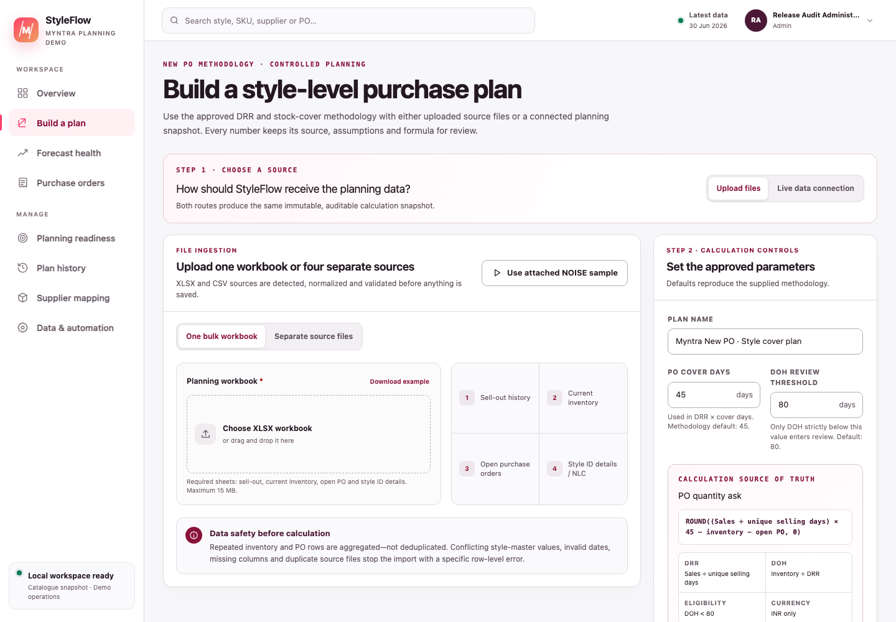
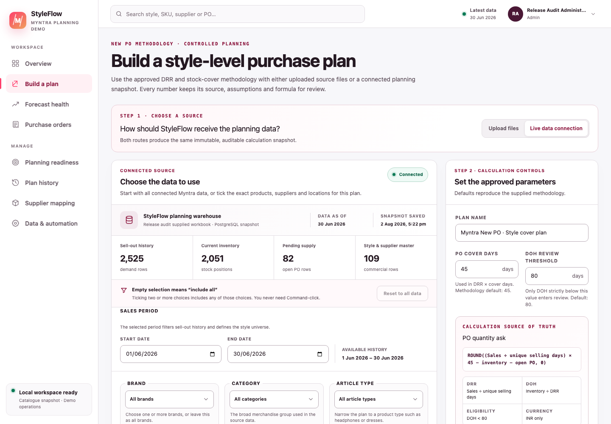
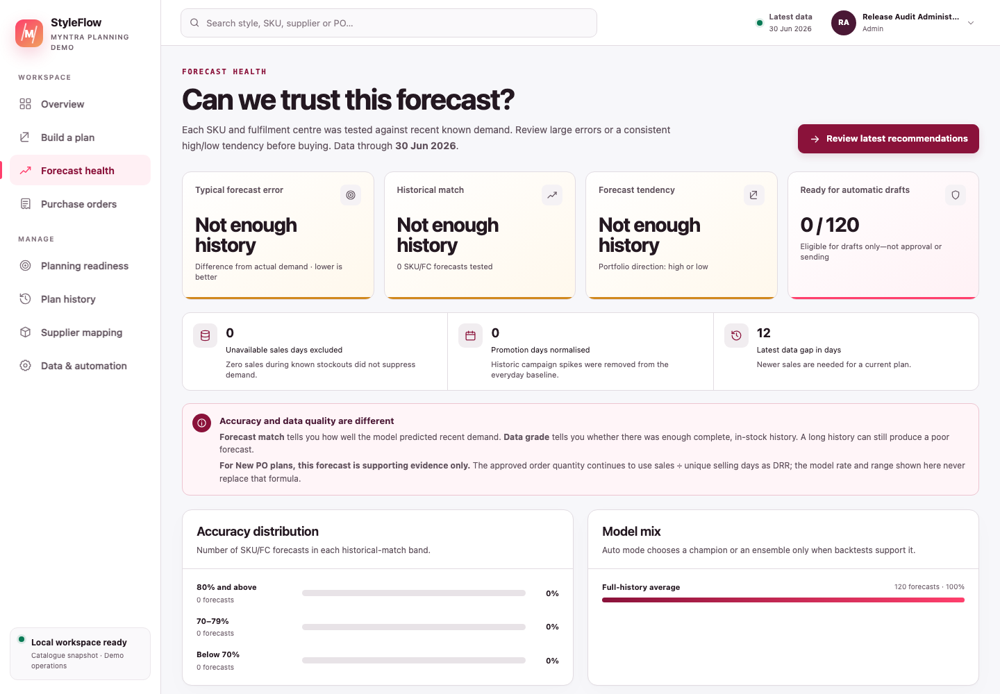
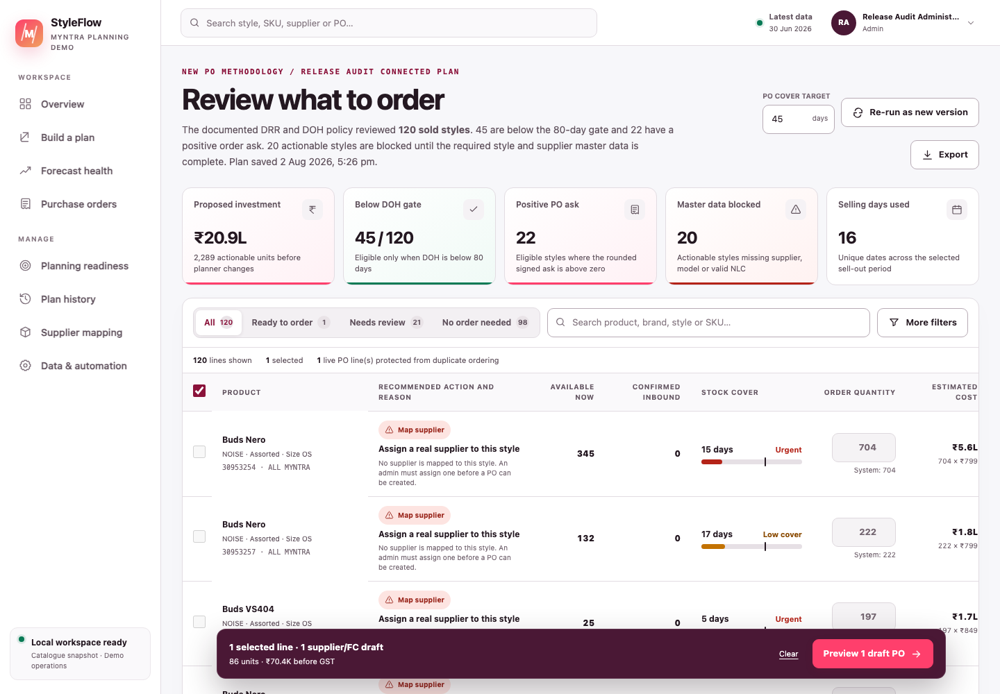
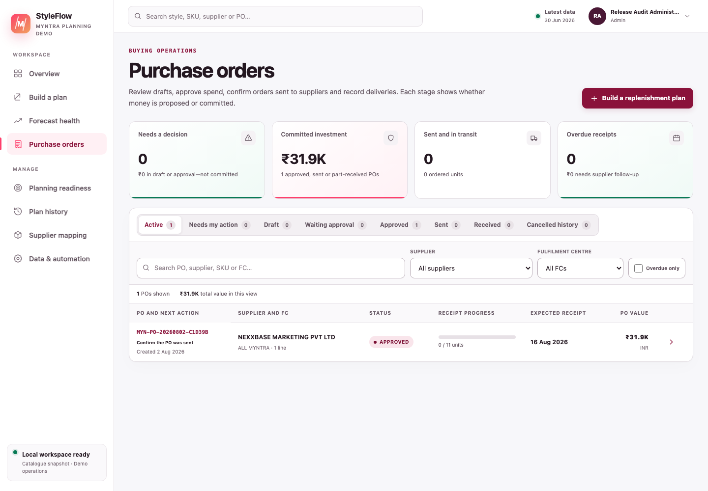
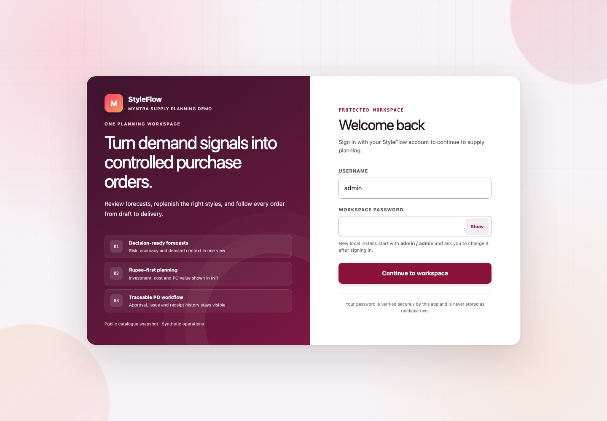
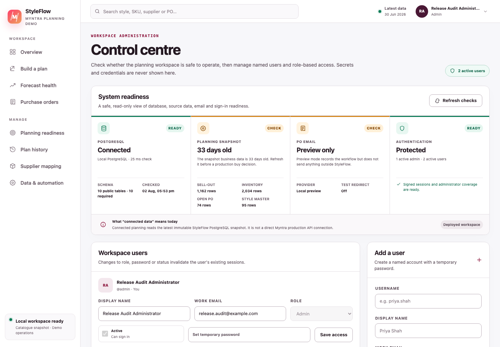
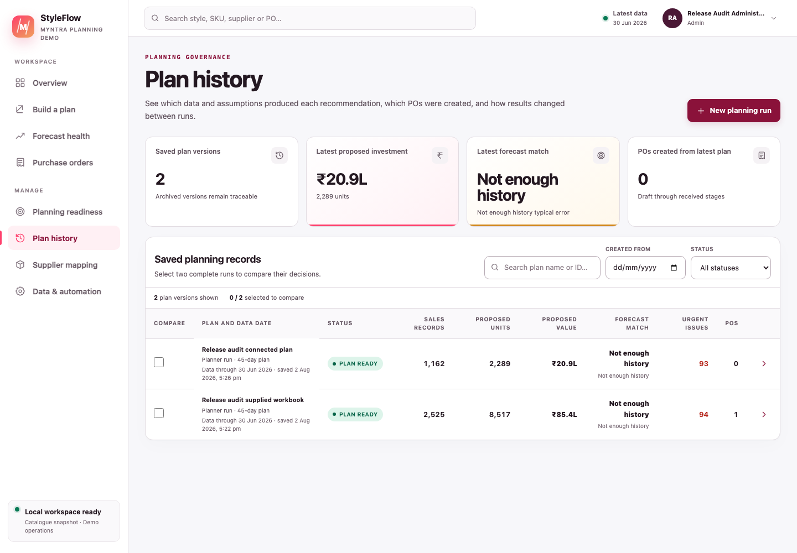
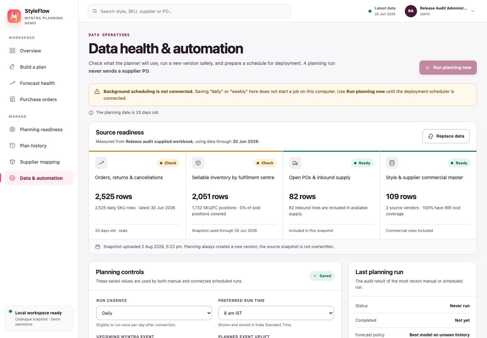

# Contents {.unnumbered}

- [Document purpose](#document-purpose)
- [Executive summary](#executive-summary)
- [Business problem and outcomes](#business-problem-and-outcomes)
- [Users, roles and five operating functions](#users-roles-and-five-operating-functions)
- [Product scope as built](#product-scope-as-built)
- [Data truth and provenance](#data-truth-and-provenance)
- [Data ingestion and connected planning](#data-ingestion-and-connected-planning)
- [Supplier mapping and planning readiness](#supplier-mapping-and-planning-readiness)
- [Approved New PO mathematics](#approved-new-po-mathematics)
- [Forecasting and accuracy evidence](#forecasting-and-accuracy-evidence)
- [Recommendation and purchase-order workflow](#recommendation-and-purchase-order-workflow)
- [Authentication, profile and administration](#authentication-profile-and-administration)
- [Architecture and data model](#architecture-and-data-model)
- [Acceptance evidence](#acceptance-evidence)
- [Risks, limitations and roadmap](#risks-limitations-and-roadmap)
- [Definition of done](#definition-of-done)

# Document purpose

This document explains what StyleFlow is, why it exists, what has been built, exactly how the New PO quantity is calculated, and what remains before production deployment. It is written so that a business owner, CEO, planner, buyer, approver, receiver, administrator or engineer can use one common description of the product.

> **Current status — local, database-backed functional application.** StyleFlow is suitable for controlled demonstration, methodology validation and user-acceptance testing. It is not yet authorised to make live Myntra purchases, and it is not connected directly to Myntra, an ERP, OMS, WMS or supplier system.

## Screenshot note

The screenshots were captured from the current local application on 2 August 2026 with a documentation-only Admin account. The active plan uses the supplied NOISE methodology sample and deliberately incomplete/synthetic commercial data so safeguards are visible. Counts and labels illustrate that captured snapshot and will change when another dataset is loaded. No private credential, database URL or API key is shown; the login’s public one-time local `admin/admin` bootstrap hint is intentional.


*Figure 1 — Current Executive view: proposed need, operationally safe-to-draft value, PO-stage commitments and forecast evidence are separated to prevent double counting.*

## Core terms

| Term | Plain-language meaning |
|---|---|
| Style / Style ID | A product design and its planning identifier. The approved calculation runs at style level. |
| SKU | A buyable variant. In the supplied New PO workbook, the Style ID is also adapted into the current recommendation SKU field. |
| Sell-out | Units sold by date and style. It defines the calculation’s style universe and demand denominator. |
| Unique selling days | The distinct sell-out dates across the entire selected dataset, not a separate count for each style. |
| DRR | Daily run rate: a style’s total sell-out units divided by the global unique selling-day count. |
| Current inventory | All supplied `inv_units_q1` rows summed for a style. |
| DOH | Days on hand: current inventory divided by DRR. A zero DRR produces `NA`, not division by zero. |
| DOH gate | A style is eligible only when its DOH is strictly below the configured threshold; the default is 80 days. |
| Open PO | Supply already ordered. All supplied `pending_qty` rows are summed by style and reduce the new ask. |
| PO cover days | Target stock horizon used in the New PO formula; the default is 45 days. |
| Signed PO ask | The formula result after Excel-compatible rounding. It can be positive, zero or negative and is retained for audit. |
| Actionable PO quantity | `max(0, signed ask)` for a style that also passes the DOH gate. |
| Model / MRP / NLC | Product name, customer list price and procurement unit cost looked up from style details. NLC values the PO. |
| Supplier mapping | The governed procurement supplier associated with a style. It is not automatically a public marketplace seller. |
| Forecast evidence | Backtest accuracy, WAPE, bias, model and confidence shown to help a planner judge risk. It does not change the approved PO formula. |
| Snapshot | A saved set of sell-out, inventory, open-PO and style/supplier data used for one plan. |
| Draft PO | An editable, unapproved purchase order. It is not committed or sent. |
| INR | Indian rupees. StyleFlow stores and displays procurement values in INR. |

# Executive summary

StyleFlow turns four sources—sell-out, current inventory, open POs and style details—into explainable, INR purchase recommendations and then carries reviewed lines through a controlled PO lifecycle.

The current flow is:

1. A named user signs in.
2. A planner uploads one four-sheet workbook, uploads four separate files, or filters the latest authoritative inbound PostgreSQL planning snapshot.
3. StyleFlow validates and saves a versioned source snapshot.
4. It calculates DRR, DOH eligibility and the signed PO ask exactly from the supplied methodology.
5. It shows forecast accuracy and risk as supporting evidence only.
6. **Review orders** takes the planner to the latest reviewable saved plan, where they resolve product and source blocks and can resolve supplier plus positive INR NLC while creating one draft.
7. Selected lines become supplier-and-warehouse-grouped draft POs.
8. An authorised user approves the PO; self-approval shows a warning and is explicitly audited, while high-value POs require a senior approver.
9. A planner previews the supplier email. Preview mode sends nothing; configured Resend delivery can send an approved PO and mark it issued only after successful, non-redirected provider acceptance.
10. A receiver records partial or full accepted quantities; the audit trail preserves each action.

The product promise is:

> **Move from auditable style demand to a controlled INR purchase order without hiding the formula, inventing supplier mappings or confusing forecast evidence with buying policy.**

# Business problem and outcomes

## Problem

Purchase planning often spans separate spreadsheets for sales, stock, open orders, product details and supplier terms. This produces four recurring risks:

- **Overbuying:** current stock or already-open supply is not deducted consistently.
- **Underbuying:** low-cover styles are not surfaced quickly enough.
- **Low trust:** users see a quantity without its denominator, gate, rounding rule or source data.
- **Weak governance:** recommendations, approvals, supplier communication and receipts are mixed together or attributed to typed names rather than authenticated users.

## Intended outcomes

| Decision-maker | Question StyleFlow answers |
|---|---|
| CEO / supply leader | What is the proposed INR investment, where is risk concentrated, and what awaits a decision? |
| Planner | Which styles pass the DOH gate, what is the signed ask, and what source or master-data issue blocks action? |
| Buyer | Which supplier drafts should be created, at what NLC and expected receipt date? |
| Approver | Is the need explained, are commercial details complete, and is any self-approval clearly warned and audited? |
| Receiver | What has been accepted, what remains open, and which GRN/invoice references were recorded? |
| Administrator | Are PostgreSQL, source data, email delivery and user access ready to operate? |

# Users, roles and five operating functions

## Server-enforced roles

| Role | Main permissions |
|---|---|
| Admin | User administration, system readiness and all operational workflows, including warned and audited self-approval. |
| Planner | Upload/filter data, build plans, prepare/edit/submit POs, preview/send approved-PO email, and record external send evidence. |
| Approver | Standard PO approval decisions and return/cancel decisions at the approval stage. |
| Senior approver | Approval of POs at or above the configured high-value threshold, plus standard approval decisions. |
| Receiver | Record accepted quantities against issued or partly received POs. |
| Viewer | Read-only planning and PO visibility. |

The default senior-approval threshold is ₹2,50,000 and is stored in Automation controls. An authorised approver may approve a PO they created; StyleFlow shows a self-approval warning and records `selfApproval: true` in the approval event.

## Five operating functions

These are application responsibilities, not five independently deployed AI agents.

| Function | Responsibility | Product surface |
|---|---|---|
| Data steward | Validates source structure, dates, quantities, INR fields and lineage | New plan; Admin readiness; Data & automation |
| Methodology controller | Applies the deterministic DRR, DOH gate and cover-day formula | Review orders and calculation drawer |
| Forecast analyst | Backtests demand models and presents accuracy, bias and confidence as evidence | Forecast health; recommendation evidence |
| Procurement controller | Enforces supplier mapping, cost, approval, email and receipt rules | Review orders; Purchase orders |
| Executive partner | Summarises investment, exposure, workload and decisions | Executive and Planner dashboards |

# Product scope as built

## Implemented

- Named-user login with signed 12-hour sessions.
- Local first-run `admin` / `admin` bootstrap with mandatory password change.
- Profile, password change, account menu and logout.
- Admin user creation, role assignment, temporary-password reset, suspension and session invalidation.
- Read-only Admin readiness for PostgreSQL, source freshness, email mode and authentication coverage.
- One bulk `.xlsx`/`.xlsm` methodology workbook or four separate `.csv`/`.xlsx` files.
- Live-data selection from the latest authoritative inbound PostgreSQL snapshot with brand, style, supplier, product, category, article type, date and—only when demand has genuine FC grain—warehouse filters.
- In-app vendor–supplier mapping master with plan-style synchronisation, search/filter, readiness states, revision-safe editing, CSV/XLSX import and governed XLSX export.
- Operations control tower that separates source, commercial, independent-approval and execution gates and assigns each next action to an owner.
- Exact, versioned New PO DRR/DOH/cover calculation.
- Explicit data-quality flags and non-overridable product, supplier, price and negative-source blocks.
- Forecast model, WAPE, historical match, bias, confidence and stockout evidence without allowing the forecast to alter the New PO quantity.
- Permanent **Review orders** navigation to the latest reviewable saved plan, with **Plan history** reserved for older versions and comparison.
- INR dashboards, recommendation filtering, quantity override reason and export/history views.
- Supplier-and-warehouse-grouped draft POs with duplicate protection.
- Warned and audited self-approval, plus high-value senior-approver control.
- Draft commercial fields, GST display, readiness checklist, print view and activity history.
- Supplier email preview, safe local no-send mode, optional Resend delivery, test redirection, idempotency and delivery audit.
- External-send evidence path when a PO was sent outside StyleFlow.
- Partial/full receipt and close lifecycle.
- Stored automation configuration and manual reruns with conservative auto-draft safeguards.

## Deliberately deferred

- A direct Myntra, ERP, OMS, WMS, catalogue, vendor-portal or EDI connector.
- Production SSO and enterprise identity-provider integration.
- Actual background scheduling on the local computer.
- Production deployment, secret manager, backup/restore, monitoring and incident response.
- Legally authoritative GSTIN, HSN, tax, contract or address validation.
- Supplier acknowledgement, delivery tracking and WMS inventory posting.
- OTB, budget, margin, minimum-order-value, freight and capacity optimisation.

# Data truth and provenance

The repository contains two different demonstration families. They must not be described as the same source.

| Data family | What it contains | Truth boundary |
|---|---|---|
| New PO regression workbook | The user-supplied `Noise_113.xlsx` sell-out, inventory, open-PO and style-detail tabs | Reproduces the supplied methodology exactly. Style names, costs, quantities and relationships are used as supplied and are not independently certified as current Myntra operational facts. |
| Enriched catalogue demo | Generated files under `sample-data/demo/` plus the public catalogue source register | Public Style ID, product name, MRP, displayed selling price, listing seller and Myntra URL were captured from dated public listings on 1 August 2026. Demand, inventory, FC, NLC, supplier rules and all PO relationships are synthetic. |

StyleFlow does not scrape or revalidate Myntra at plan time. Public prices, sellers and availability can change by date, promotion, session, size or location. A public marketplace seller is not automatically a procurement supplier, and a captured customer selling price is not NLC. Only governed INR NLC/unit cost values a PO.

# Data ingestion and connected planning

## Route A — one bulk workbook

The workbook must contain one recognisable source for each of the following. Sheet matching is case-insensitive and understands the supplied names and common aliases.

| Source | Required fields | Purpose |
|---|---|---|
| Sell-out | `order_Month`, `style_id`, `qty` | Selling dates, style universe and sales units |
| Current Inventory | `style_id`, `inv_units_q1` | Inventory and DOH |
| Open PO | `style_id`, `pending_qty` | Already-ordered supply |
| Style ID details | `Style Id`, `Model`, `MRP`, `NLC` | Product identity and INR pricing |

The supplied `sample-data/methodology/Noise_113.xlsx` is the regression workbook. Unrelated worksheets can be ignored, but a recognised source sheet with invalid headings or data stops the import.

## Route B — four separate files

The planner supplies exactly one sell-out, inventory, open-PO and style-details file. Each may be CSV or XLSX. All four are required, although the open-PO file may contain only its header when nothing is pending.

Recommended optional columns include:

- sell-out/inventory/open PO: brand, business unit, article type, category and warehouse fields;
- open PO: vendor, status and estimated shipment date;
- style details: `Vendor`, `Contact_Email`, `Supplier_SKU`, `HSN_Code`, `GST_Rate`, `Supplier_GSTIN`, `Supplier_State`, `Lead_Time_Days`, `Payment_Terms`, `Incoterms`, `MOQ` and `Pack_Size`.

These style-detail extras populate the saved supplier/commercial master and make later PO preparation faster. GST rate is validated from 0–100; lead time, MOQ and pack size must be non-negative whole numbers. MOQ and pack size remain review evidence under the approved New PO method—they do not round or otherwise change its exact signed ask.

The app rejects a mixed bulk-plus-separate submission, duplicate source files, missing sources, unreadable files, conflicting style-master records, invalid dates and malformed quantities. Limits are 15 MB per uploaded file and 100,000 combined data rows. Dates accept `YYYYMMDD` or `YYYY-MM-DD`. Header matching ignores case and common spaces, underscores and hyphens.

Repeated sell-out, inventory and open-PO rows are legitimate and are summed. They are not silently deduplicated. The sales source defines the style universe; inventory-only, open-PO-only and master-only styles are reported as data-quality differences.



*Figure 2 — Current New PO builder. Upload one workbook or switch to four separate sources; the Live data connection is the second source route.*

## Route C — live data connection

“Live” currently means the **StyleFlow planning warehouse**: the latest non-archived, authoritative inbound/root snapshot stored in PostgreSQL. It is not a direct production API. A filtered live plan and an automation rerun are derived outputs, so they are deliberately not reused as the next connection source.

The user can select:

- brand;
- Style ID;
- supplier;
- product;
- category;
- article type;
- warehouse, when the sell-out source is genuinely fulfilment-centre grained; and
- sell-out start/end date.

Important filter semantics:

- product filters first resolve to Style IDs so source rows do not need to repeat every catalogue attribute;
- the date range filters sell-out and therefore defines the selected style universe and DRR denominator;
- a supplier filter chooses the applicable commercial master rows, but **all pending supply for selected styles remains included** to avoid double-buying against a PO placed with another supplier;
- a warehouse filter is exposed only when every sell-out row has a real, non-network warehouse. Workbook methodology sell-out is network/style/date grained, so warehouse filtering is hidden and all matching inventory/open supply is retained; this avoids combining total-network demand with only one warehouse’s supply;
- a filtered run writes a new batch and never overwrites the source batch through the intended workflow.

The connection cannot be used until at least one valid source snapshot has been uploaded and saved.



*Figure 3 — Current Live data connection. It identifies the authoritative PostgreSQL snapshot, shows row counts and source dates, and explains that an empty multi-select includes all values.*

# Supplier mapping and planning readiness

## In-app vendor–supplier mapping master

The mapping master gives planners and administrators one governed place to connect a Myntra Style ID to an authorised procurement supplier and the fields required for a usable PO: supplier SKU/email, INR NLC, HSN, GST, GSTIN/state, lead time, payment terms, Incoterms, MOQ and pack size.

It supports:

- **Bring in plan styles:** inserts only missing Style ID/supplier relationships from the latest plan; existing mappings are never overwritten;
- **Mapped, incomplete and unmapped states:** each row exposes an exact list of missing fields;
- **revision-safe changes:** stale edits receive a conflict instead of overwriting a newer revision;
- **CSV/XLSX import and XLSX export:** the same validation rules apply to manual and bulk edits; spreadsheet formula injection is neutralised during export;
- **unambiguous application:** an explicit uploaded supplier identity wins; a placeholder is replaced only when the in-app master has one unambiguous supplier; and
- **plan provenance:** generated recommendations retain the mapping source, applied revisions and a reproducible fingerprint.

Draft readiness is deliberately staged. A real supplier plus positive INR NLC is the commercial minimum for an editable draft. Supplier email, HSN/GST, GSTIN/state, lead time, payment terms, Incoterms, MOQ and pack size support dispatch readiness and can be completed on the draft. Any MOQ or pack rule that is supplied is enforced.

For a blocked recommendation, **Add supplier & raise PO** lets an authorised planner select an existing mapping revision or complete an unmapped relationship. The mapping update, recommendation claim and draft creation succeed or fail together. The draft records the applied mapping ID/revision; the saved plan and approved quantity formula are not rewritten. Multiple applicable suppliers require an explicit choice, and a stale revision is rejected.

Mapping status validates application presence and format; it does not certify supplier authority, contract terms, tax registration ownership or price approval. Those remain organisational governance responsibilities.


*Figure 4A — Current supplier mapping master: plan synchronisation, commercial readiness and bulk maintenance remain visible in one sheet.*

## Operations control tower

Planning readiness aggregates the latest snapshot, positive recommendations, mapping health and PO queues into four separately owned gates:

1. **Data owner — source gate:** sell-out, inventory and inbound supply are present and current enough for planning.
2. **Planner/commercial owner — commercial gate:** positive recommendations have product, cost and supplier evidence needed for drafting.
3. **Approver — approval gate:** submitted POs receive an approval decision; self-approval is visibly warned and audited.
4. **Buyer/receiver — execution gate:** approved orders are dispatched, overdue receipts are escalated and deliveries are recorded.

The overall state is **Blocked** when a non-overridable gate fails, **Review** when a human decision is waiting, and **Clear** when no current exception is open. “Clear” is a current operating result, not a promise that source facts or future demand will remain unchanged.


*Figure 4B — Current Planning readiness view: each unresolved action has an owner, value/count and direct route to the working screen.*

# Approved New PO mathematics

The implementation is versioned as `new-po-methodology/2026-08-02-v1` and follows `New_PO_Methodology.md` at style level.

## 1. Style universe and selling days

Let `S` be all distinct Style IDs in the selected sell-out data. Let `D` be the distinct count of sell-out dates across the entire selection.

$$
D=\operatorname{countDistinct}(order\ dates)
$$

The same `D` is used for every style. A style that sold on only one of 30 available dates still uses 30 as its denominator.

## 2. Sales and DRR

For style `s`:

$$
Sales_s=\sum qty_s
$$

$$
DRR_s=\frac{Sales_s}{D}
$$

Plain language: add every sell-out quantity for the style, then divide by the global number of unique selling dates.

## 3. Inventory and DOH gate

$$
Inventory_s=\sum inv\_units\_q1_s
$$

$$
DOH_s=\frac{Inventory_s}{DRR_s}
$$

If `DRR = 0`, DOH is `NA` and the style is excluded. Otherwise:

$$
Eligible_s=DOH_s<T
$$

where `T` is the configured DOH threshold, 80 by default. The comparison is strict: exactly 80 is not eligible.

## 4. Open supply and signed ask

$$
OpenPO_s=\sum pending\_qty_s
$$

$$
RawAsk_s=(DRR_s\times C)-Inventory_s-OpenPO_s
$$

$$
SignedAsk_s=ExcelRound(RawAsk_s,0)
$$

where `C` is PO cover days, 45 by default. `ExcelRound` rounds to the nearest whole unit and sends exact halves away from zero: `91.5 → 92`, `−49.5 → −50`.

## 5. Actionable quantity

$$
ActionableQty_s=\begin{cases}
\max(0,SignedAsk_s),&DOH_s<T\\
0,&otherwise
\end{cases}
$$

The signed ask remains visible even when it is negative or the DOH gate excludes the style. This preserves what the formula calculated while preventing a negative order.

## Worked example — Style 36627115

The supplied workbook contains these source results:

| Input | Value |
|---|---:|
| Total sell-out | 3,265 units |
| Global unique selling days | 30 |
| Current inventory | 461 units |
| Open PO | 0 units |
| Cover days | 45 |

$$
DRR=3,265\div30=108.8333
$$

$$
DOH=461\div108.8333=4.235\ days
$$

The style passes the strict 80-day gate.

$$
RawAsk=(108.8333\times45)-461-0=4,436.5
$$

$$
SignedAsk=ExcelRound(4,436.5)=4,437\ units
$$

The actionable quantity is therefore **4,437 units**. NLC for this sample style is ₹1,065.18, so its pre-GST merchandise value is:

$$
4,437\times₹1,065.18=₹47,26,203.66
$$


*Figure 4 — Current formula drawer: strict DOH gate, DRR, cover target, stock, open PO, Excel-style rounding and actionable quantity remain visible together.*

## Negative example

Style `41280678` has a signed ask of `−50`. StyleFlow retains `−50` in the explanation and sets the actionable quantity to `0`.

## Data-quality behaviour

| Condition | Current behaviour |
|---|---|
| Missing inventory row | Defaults to zero so the Excel-compatible calculation remains auditable, but draft-PO conversion is blocked until current inventory is supplied or an explicit confirmed-zero control is implemented. |
| Missing open-PO row | Defaults to zero and reports the missing match; the planner must verify that no supply is pending. |
| Missing Model or MRP | The formula can still be audited, but draft-PO creation is blocked until the style master is corrected. |
| Missing NLC | The standard selection is blocked. An authorised planner can provide a positive INR NLC with the supplier through **Add supplier & raise PO**. |
| Missing or ambiguous supplier | The standard selection is blocked. An authorised planner can use **Add supplier & raise PO**, explicitly choose or enter the legal supplier and provide positive INR NLC, then create one editable draft. |
| Negative aggregated sales, inventory or open PO | Critical source-data block; it cannot be overridden into a PO. |
| Zero DRR | DOH is `NA`; the style does not pass the DOH gate. |
| Conflicting master rows | Import stops instead of choosing one value. |

# Forecasting and accuracy evidence

Forecasting remains useful for risk review, but it is deliberately outside the approved New PO quantity.

For evaluated holdout days:

$$
WAPE=\frac{\sum|Forecast-Actual|}{\sum|Actual|}
$$

$$
HistoricalMatch=\max(0,1-WAPE)
$$

$$
Bias=\frac{\sum(Forecast-Actual)}{\sum|Actual|}
$$

- Lower WAPE is better.
- Higher historical match is better.
- Positive bias means the model tended to forecast high; negative bias means it tended to forecast low.
- Confidence/data grade reflects whether the evidence is complete enough, not just whether recent error happened to be small.

StyleFlow tests average, recent moving average, recency-weighted, weekday-seasonal, local-trend and—when appropriate—Croston intermittent-demand candidates. These results help a planner question demand, stockout and uncertainty. They do **not** multiply, cap, replace or otherwise modify the DRR/DOH/cover ask.



*Figure 5 — Current Forecast health view. In a New PO plan these metrics remain supporting evidence, never the quantity source of truth.*

# Recommendation and purchase-order workflow

## Recommendation readiness

A style with positive actionable quantity is not automatically draft-ready. The current non-overridable checks require:

- Model/product name;
- valid positive MRP;
- a matched current-inventory row;
- a real, non-placeholder supplier and positive INR NLC, either saved in the planning batch or explicitly resolved from the current mapping revision at draft time;
- no negative sales, inventory or open-PO source exception.

Supplier email, tax and dispatch fields may be completed on the editable draft, but remain subject to strict send-readiness checks. A transaction-time mapping is an execution overlay: it records mapping provenance on the PO and never mutates the recommendation or its formula. Forecast concerns and other operational risks can require acknowledgement, but acknowledgement does not repair missing master data.



*Figure 6 — Current style-cover workbench: DOH eligibility, signed ask, master-data blocks, selectable quantity and INR value are visible before drafting.*

## Draft creation

The planner can select eligible, unblocked lines and may enter a different positive quantity only with a reason. Drafts are grouped by supplier and warehouse. For a supplier-blocked line, **Add supplier & raise PO** asks for the legal supplier and positive INR NLC, requires an explicit choice when multiple mappings apply, and atomically saves the selected mapping revision with one draft. A live PO for the same plan batch, warehouse and style/SKU blocks duplicate drafting regardless of which supplier is selected.

Creating a draft:

- saves editable PO rows and INR values;
- sets an operational expected-delivery date no earlier than the India order date plus the saved supplier lead time, even when the source snapshot is historical;
- does not approve spend;
- does not email a supplier;
- does not reserve budget; and
- does not update inventory.

## Lifecycle

```text
Recommendation
    → Draft
    → Waiting approval
    → Approved
    → Sent / Issued
    → Part received
    → Received
    → Closed
```

Cancelled orders remain in history. Only drafts are editable.



*Figure 7 — Current PO queue: decision workload, commitment and receipt progress remain separated.*

## Approval controls

- The signed-in database identity, not a typed actor name, is written to the audit event.
- Each PO mutation carries the revision the user loaded. Draft edits, status changes, receipts, email issuance and reconciliation increment that revision; a stale request is rejected so one session cannot silently overwrite another.
- `approver`, `senior_approver` or `admin` can approve, including their own PO.
- Self-approval requires a visible confirmation warning and is marked in the approval-event payload.
- At or above the configured threshold, only a Senior Approver or Admin can approve; either may be the creator after the self-approval warning.
- Return-to-draft and cancellation paths require a reason where configured.

## Send readiness

Before an approved PO can be issued through either email or the external-send path, the app requires:

1. buyer GSTIN;
2. supplier GSTIN;
3. ship-to address;
4. place of supply;
5. expected delivery date;
6. at least one order line;
7. HSN on every line; and
8. a positive unit cost on every line.

These are presence and basic numeric controls, not legal validation. They remain hard real-supplier and external-dispatch blocks for non-Admin users; non-delivering or redirected tests are exempt.

On an Approved PO, Admin retains both real supplier email and external-send actions when these checks fail, but can proceed with either dispatch only through an explicit audited exception. The UI lists the exact missing fields and requires a checked override plus a meaningful 10–1,000 character reason. The server accepts the exception only from the `admin` role and records the missing-field snapshot, reason and authenticated actor in `po_events` and the email-delivery audit. Local preview and `EMAIL_FORCE_TO` tests are not dispatches and need no override. The exception does not bypass an invalid status transition, invalid recipient, email-provider/test-redirect safety, a fresh matching preview for real supplier email, an existing Processing/Uncertain/Sent delivery claim or idempotency.


*Figure 8 — Current draft PO detail: commercial fields and ready-to-send checks show exactly what must be completed before approval and supplier issue.*

## Email flow

| Mode/action | What happens |
|---|---|
| Generate preview | Validates recipients, renders the exact saved PO—including dates, addresses, GSTINs, HSN, GST, terms, adjustments and INR totals—and records a preview event. Nothing is sent. For real supplier delivery, its opaque delivery ID authorises only the same user's fresh, unchanged recipient/message payload. |
| `EMAIL_PROVIDER=preview` | Even “Test send” remains inside StyleFlow, records the attempt and keeps the PO Approved. Missing dispatch readiness and a missing pre-generated preview do not block this safe test. |
| `EMAIL_PROVIDER=resend` | A configured, successful non-redirected provider **acceptance** records the provider ID, appends an `email_sent` event and changes Approved to Sent/Issued. Dispatch readiness (or an Admin override) and a matching fresh preview are required. Provider acceptance is not proof that a recipient opened the message. |
| `EMAIL_FORCE_TO` set | Resend redirects every test message to controlled recipients, removes CC and prefixes the intended recipient in the subject. The supplier is not treated as contacted and the PO remains Approved; readiness and pre-generated-preview gates do not apply. |
| Provider failure | Records a failed delivery and leaves the PO Approved. |
| Timeout/uncertain response | The request stops after 15 seconds, changes from Processing to Uncertain and must not be retried. An administrator checks provider evidence, records a reconciliation note, then either confirms provider acceptance or releases a safe retry. |
| External send | A planner can mark an approved PO sent outside StyleFlow only after readiness passes and a traceable evidence note is entered. Admin may override missing readiness details only with the separate audited checkbox/reason; external-send evidence remains mandatory. |

Email actions use idempotency keys and the database prevents more than one Processing, Uncertain or Sent in-app dispatch for a PO. A real supplier send also revalidates the preview ID, PO freshness, actor and exact composed fields server-side rather than relying on the browser's disabled state.

## Receipt and INR totals

Only Issued or Part-received POs accept receipts. Each accepted quantity must be a positive whole number for a valid, non-duplicated PO line; over-receipt is rejected. The receipt date must be a real calendar date, no later than today and no earlier than the PO date. A partial receipt keeps the balance open; receiving all remaining units moves the PO to Received. Inventory itself changes only when the next inventory snapshot is uploaded or connected.

PO monetary calculations are:

$$
Subtotal=\sum(quantity_i\times unitCost_i)
$$

$$
Tax=\sum(quantity_i\times unitCost_i\times GST_i/100)
$$

$$
GrandTotal=\max(0,Subtotal+Freight-Discount+Tax)
$$

All UI-created PO line currencies are INR. When non-empty supplier and buyer state text matches exactly, the display splits tax into equal CGST and SGST halves; otherwise it displays IGST. This is display logic, not a statutory tax determination.

# Authentication, profile and administration

## First local login

On an empty local PostgreSQL database, `npm run db:init` creates:

```text
Username: admin
Password: admin
```

This default exists only for a local, non-production database. The first session is redirected to **Profile & security** and cannot use the rest of the app until the password is changed. The new password must contain 10–200 characters and cannot equal the username or `admin`.

Remote and production databases never create `admin/admin`; explicit bootstrap credentials are required.



*Figure 9 — Current login. A new local database explains the one-time `admin/admin` bootstrap without displaying the password field.*

## Security controls

- Passwords are salted and hashed with scrypt; readable passwords are not stored.
- Session cookies are signed with `AUTH_SECRET`, HTTP-only, same-site and valid for 12 hours.
- Protected API routes re-read the active database user, role and session version.
- Five failed sign-in attempts lock the account for 15 minutes.
- Password, role or active-status changes invalidate prior sessions.
- A user can update display name, work email and password, then sign out from the account menu.

## Administrator controls

The Admin control centre provides:

- PostgreSQL connection/schema status and response time;
- latest snapshot label, dates, freshness and source row counts;
- email provider, preview/live state and test-redirect status;
- uncertain supplier-email requests that require provider-evidence reconciliation before any retry;
- signed-session readiness, user/admin counts and temporary-password warnings;
- user creation with a temporary password;
- role, display name, email, suspension and password-reset controls; and
- safeguards against demoting/suspending oneself or removing the final active admin;
- a username-first access directory where **Manage access** opens one person’s page matrix;
- page access by role, followed by per-user Allow/Deny exceptions;
- immediate enforcement on direct page and mapped API requests, with optimistic revision protection and an access-policy audit event; and
- a permanently Admin-only access-control area that cannot be delegated or denied to Administrators.

The desktop sidebar can be minimised to a 74-pixel icon rail with the circular edge control. This preference is stored in the browser, labels remain available as accessible names/tooltips, and the page canvas expands beyond the normal 1,500-pixel content cap while compact.

The readiness API deliberately does not return database connection strings, API keys, password hashes or user email addresses.



*Figure 10 — Current Admin control centre: PostgreSQL, source freshness, email mode, authentication coverage and user access are visible without exposing secrets.*

# Architecture and data model

## Technology

| Layer | Implementation |
|---|---|
| Web application | Next.js 16 App Router, React and TypeScript |
| UI | Responsive repository-native CSS and accessible dialogs/controls |
| Backend | Next.js route handlers with authenticated server-side permission checks |
| Database | PostgreSQL; `postgres.js` locally and the Neon serverless driver for Neon-hosted PostgreSQL remotely. Generic RDS, Supabase and other hosted providers are not configured in the current remote path. |
| Workbook/CSV import | ExcelJS and Papa Parse |
| Email | Local preview or Resend HTTP API |
| Testing | Vitest, TypeScript and Next.js production build checks |

## Data flow

```text
Bulk workbook / four files / filtered PostgreSQL snapshot
                        │
                        ▼
             Parse, validate and preserve source
                        │
                        ▼
              Versioned planning batch (JSONB)
                        │
          ┌─────────────┴──────────────┐
          ▼                            ▼
Exact DRR/DOH/cover formula     Forecast/risk evidence
          └─────────────┬──────────────┘
                        ▼
              Explained recommendations
                        │
                        ▼
 Draft → approval → email/external issue → receipt → close
```

## PostgreSQL tables

The required application schema contains ten tables:

| Table | Purpose |
|---|---|
| `app_users` | Named users, roles, password hashes, lock state and session revocation version |
| `batches` | Source snapshots, methodology settings and recommendation JSONB |
| `purchase_orders` | PO header, supplier email, INR totals and line JSONB |
| `po_recommendation_claims` | One-time recommendation-to-PO conversion claims |
| `email_deliveries` | Preview/send attempts, recipients, provider result and audit identity |
| `po_events` | Workflow, email and receipt history appended by the application |
| `automation_rules` | Cadence, event, auto-draft and approval-threshold settings |
| `integration_runs` | File-import, live-snapshot and automation execution history |
| `supplier_style_mappings` | Governed Style ID–supplier commercial relationships and revisions |
| `schema_migrations` | Applied application-schema migration markers |

Snapshot and event immutability are application-workflow conventions; the database does not yet enforce a fully append-only ledger.

# Acceptance evidence

The supplied workbook is protected by an exact regression test. With cover days `45` and threshold `80`, it must produce:

| Regression measure | Expected |
|---|---:|
| Source rows | 4,767 |
| Sell-out date range | 1–30 June 2026 |
| Global unique selling days | 30 |
| Sell-out styles | 121 |
| Styles below 80 DOH | 49 |
| Positive actionable styles | 24 |
| Positive actionable units | 8,517 |
| Style `36627115` ask | 4,437 |
| Style `30953258` ask | 92 |
| Style `31744535` open PO / ask | 80 / 11 |
| Style `41280678` signed / actionable | −50 / 0 |

The test suite also covers importer errors, half-away-from-zero rounding, zero DRR, live filter semantics, PO readiness, role access, session security, email rendering/provider rules, Admin readiness and PO calculations.

Final local release-candidate evidence on 2 August 2026:

| Gate | Result |
|---|---|
| Automated regression | 25 test files; 183 tests passed |
| Type safety | TypeScript completed with no error |
| Production build | Next.js 16.2.12 Webpack build completed; all application/API routes generated |
| Dependency advisory check | 0 known npm vulnerabilities across production and development dependencies |
| Local PostgreSQL | 14/14 required tables ready; access constraints and INR header/line integrity verified |
| Visual/accessibility smoke | Nine primary routes fitted 390 px mobile and 1,440 px desktop without document overflow; modal focus and mobile navigation verified |
| Bulk methodology | 121 recommendations; every row recomputed against the exact DRR, strict DOH gate, Excel half-away rounding and INR valuation |
| Four-file Myntra demo | 27 recommendations and 11,747 actionable units; return, cancellation, promotion and in-stock forecast evidence preserved without changing exact PO maths |
| Supplier mapping | Sync/import/export, no-overwrite replay, CRUD and stale-revision conflict passed |
| PO lifecycle | MOQ/pack, duplicate claim, stale edit, warned/audited self-approval, preview-only email idempotency, partial/full receipt and close passed end to end |

Live provider delivery, a production Myntra connector and remote Neon migration were not exercised; they remain explicit deployment acceptance gates.

Recommended release checks are:

```bash
npm test
npx tsc --noEmit
npm run build
npm run db:check
npm run docs:build
```



*Figure 11 — Current Plan history. File and connected runs create distinct saved records for older-version review and comparison; Review orders opens the latest reviewable plan directly.*

# Risks, limitations and roadmap

| Risk / limitation | Current position | Production response |
|---|---|---|
| “Live” data meaning | Reads the latest authoritative inbound/root StyleFlow PostgreSQL snapshot, not Myntra production; derived live/automation plans are excluded as future source anchors | Build authorised source connectors with lineage, reconciliation and service ownership |
| Supplier truth | User-supplied mapping; missing/ambiguous values are blocked | Integrate governed vendor master and contract identifiers |
| Email delivery | Preview is safe locally; Resend is optional and externally configured | Verified domain, monitored delivery, acknowledgements, bounce handling and support ownership |
| Identity | Named users and server RBAC exist; no enterprise SSO | Connect approved IdP, MFA and joiner/mover/leaver process |
| Tax/legal | Presence/basic numeric checks only | Finance-approved GST, HSN, address and contract validation |
| Scheduler | Settings persist; local background runner is disconnected | Authenticated scheduler or Vercel Cron with alerting and idempotency |
| Database scale | Snapshot-heavy JSONB | Normalise high-volume facts, index and migrate with governed retention |
| Audit immutability | APIs append history; DB constraints are not append-only | Immutable event ledger, privileged-change monitoring and backups |
| Multi-supplier draft request | Each supplier group commits atomically and one-time recommendation claims make retry safe, but one request spanning several suppliers is not a single all-or-nothing database transaction | Wrap the complete multi-supplier orchestration in a governed transaction/work queue when partial group creation is unacceptable |
| Master-data history | Users and supplier mappings retain revision/updater metadata; they do not yet have a complete event-by-event change ledger | Add append-only before/after audit events and retention/access policy for every master mutation |
| Preserved historical rows | New schema checks are added `NOT VALID` where necessary so an existing local database is not destructively rejected; business-critical JSON/INR checks run in `db:check` | Profile and clean legacy rows, validate every deferred constraint, and rehearse the migration before production cutover |
| Forecast performance | Evidence is backtested on supplied/demo data | Production data validation, drift monitoring and benefit measurement |
| Deployment | Local only in this milestone; the implemented remote driver targets Neon-hosted PostgreSQL | Vercel/GitHub plus Neon, or separately implement and verify a driver/configuration path for another hosted PostgreSQL provider; add secrets, backups, monitoring and disaster recovery |



*Figure 12 — Current automation view. Its warning correctly states that saving a schedule locally does not start a background job.*

## Recommended roadmap

### Phase 1 — production safety

- SSO/MFA and enterprise access lifecycle.
- Neon-hosted PostgreSQL for the current remote path, or an explicitly implemented/tested adapter for another provider; add migrations, encrypted backups and restore testing.
- Secret manager, email-domain governance, logs, metrics and alerts.
- Formal owner sign-off for source, supplier, tax and approval policies.

### Phase 2 — operational integration

- Authorised Myntra/ERP/OMS/WMS ingestion into the canonical snapshot contract.
- ERP/EDI PO transmission and supplier acknowledgement.
- WMS receipts and reconciled inventory refresh.
- Late-supply, approval and delivery notifications.

### Phase 3 — planning and commercial optimisation

- OTB and category budgets.
- Margin, minimum-order-value, freight and supplier-capacity constraints.
- FC transfer recommendations before external purchase.
- Scenario comparison for cover days, DOH threshold and budgets.

### Phase 4 — forecast automation

- Scheduled rolling backtests and drift alerts.
- Cold-start and hierarchical forecasts for new styles.
- Price, promotion, availability and event covariates.
- Plan-versus-actual and realised working-capital measurement.

# Definition of done

This local/database milestone is complete when a user can:

1. initialise PostgreSQL and sign in with a named account;
2. replace the local first-use password;
3. create a New PO plan from one workbook, four separate files or a filtered saved snapshot;
4. reproduce and explain the global-day DRR, strict DOH gate and Excel-rounded signed ask;
5. see forecasts as evidence without allowing them to alter the approved formula;
6. resolve product and source blocks, and either pre-map or enter supplier plus positive INR NLC while drafting;
7. create, submit and separately approve an INR PO;
8. preview supplier communication safely and optionally deliver through configured Resend;
9. record receipts and inspect the full activity trail; and
10. let an administrator manage users and check operational readiness without exposing secrets.

GitHub/Vercel deployment and direct production data connections remain deliberately deferred.

# Reference files

- `README.md` — local setup, environment and technical overview.
- `sample-data/methodology/New_PO_Methodology.md` — supplied methodology source of truth.
- `sample-data/methodology/Noise_113.xlsx` — exact regression workbook.
- `sample-data/methodology/*.csv` — four separate-source templates.
- `lib/new-po-methodology.ts` — deterministic calculator.
- `lib/new-po-import.ts` — workbook/CSV import contract.
- `lib/live-data.ts` — connected-snapshot filter semantics.
- `lib/new-po-engine.ts` — recommendation adapter and forecast evidence.
- `lib/recommendation-review.ts` — non-overridable PO readiness.
- `lib/email.ts` — preview/Resend renderer and delivery adapter.
- `lib/session.ts` and `lib/auth.ts` — login, session and role identity.
- `lib/schema.sql` — PostgreSQL schema.
