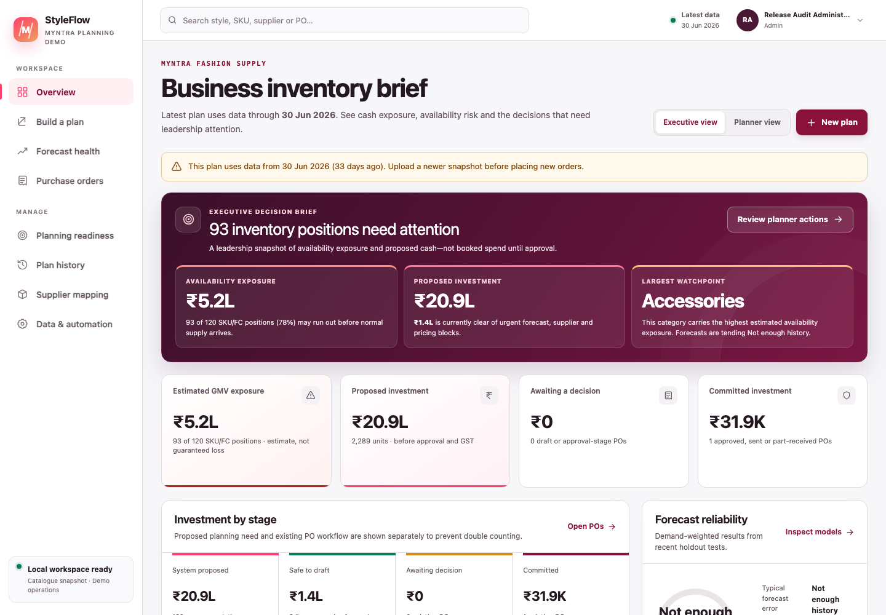
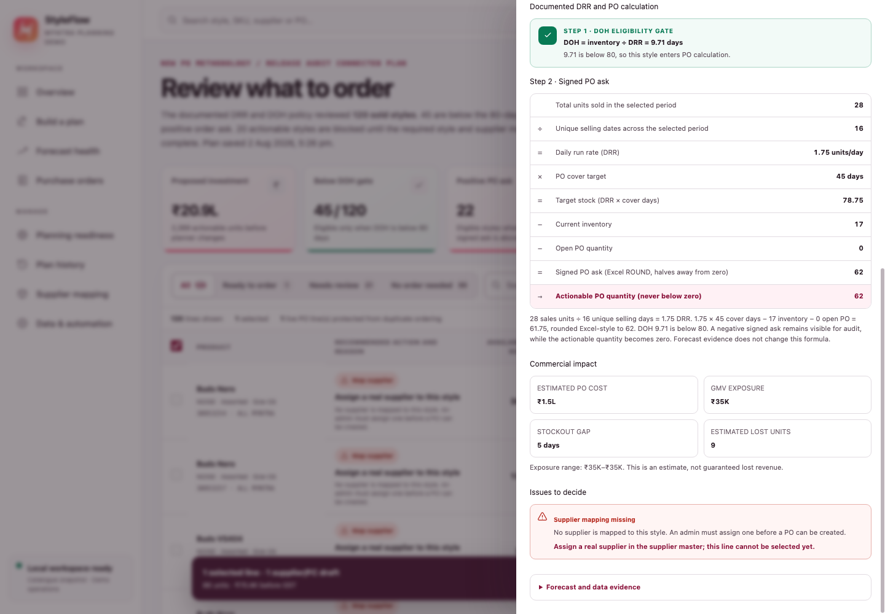
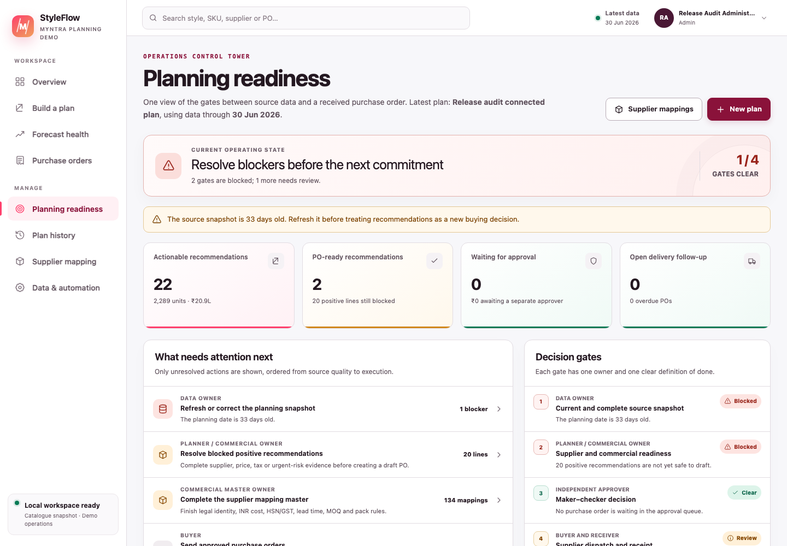
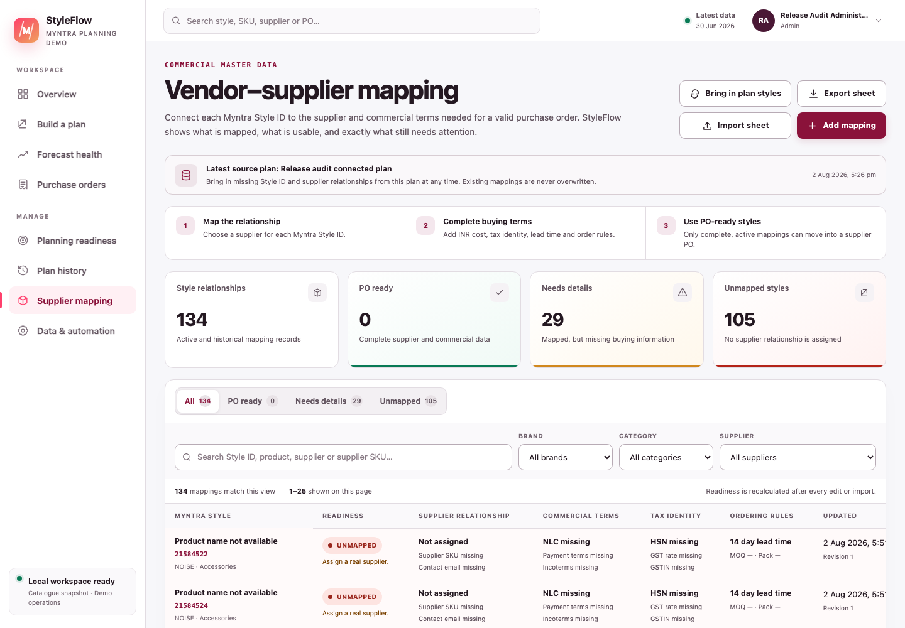
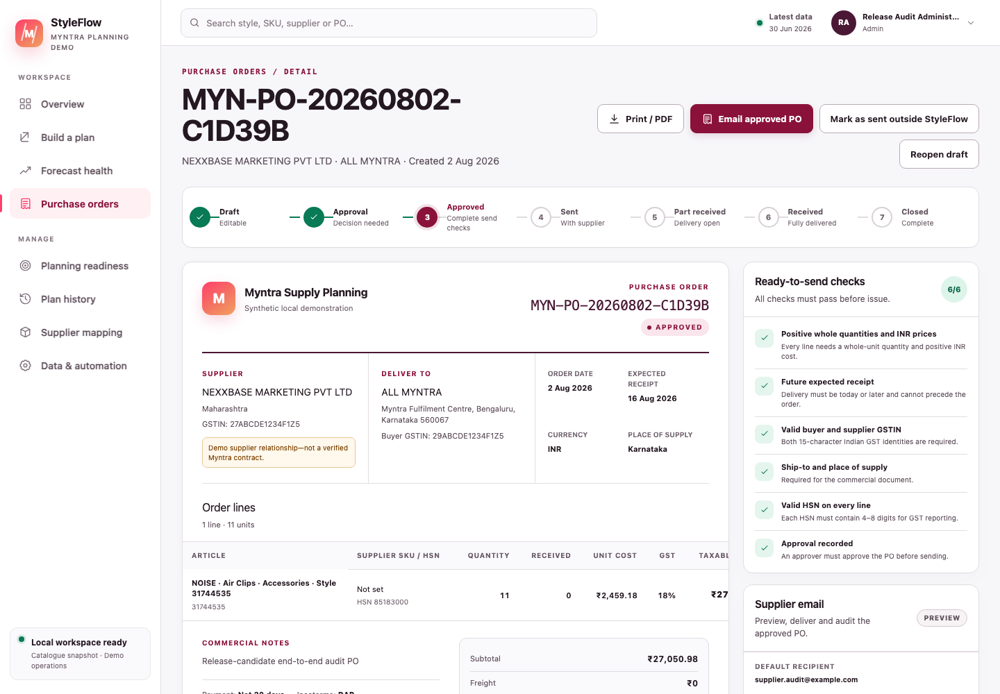

# How to use this handbook {.unnumbered}

This document explains every specialist business, calculation, data, forecast, commercial, workflow, email, role and system term used in StyleFlow. It is written for a reader who has never worked in merchandising, supply planning, procurement or software.

Use it in three ways:

1. **When a screen is unfamiliar:** find its page in [Screen-by-screen language](#screen-by-screen-language).
2. **When a number is unfamiliar:** use [The PO calculation from start to finish](#the-po-calculation-from-start-to-finish).
3. **When a word or acronym is unfamiliar:** use the grouped dictionary beginning at [Planning, product and data terms](#planning-product-and-data-terms).

> **Important scope:** StyleFlow is a local, PostgreSQL-backed planning and PO-control application. The demo contains dated public Myntra catalogue facts plus clearly synthetic planning, supplier and commercial assumptions. It is not connected directly to Myntra, an OMS, ERP, WMS, supplier portal or bank, and it cannot prove that a public marketplace seller is an authorised procurement supplier.

Ordinary interface words such as **Save**, **Cancel**, **Search**, **Next** and **Back** keep their normal meaning. This handbook covers every word that has a special meaning in this application.

# The whole application in one minute

StyleFlow follows one controlled chain:

**Planning snapshot → exact PO calculation → recommendation review → supplier mapping → draft PO → independent approval → supplier dispatch → goods receipt → closure**

- The **planning snapshot** stores sell-out, inventory, pending supply and style/commercial information.
- The approved calculation creates a signed **PO ask** from DRR, DOH, cover days, inventory and open PO units.
- Forecasts supply uncertainty evidence; they do not change the approved PO quantity.
- A positive recommendation must pass the non-overridable formula and master-data controls before it can become a draft; an allowed urgent operational risk additionally requires explicit acknowledgment.
- An authorised person approves the draft; if they are also the creator, StyleFlow warns them and records self-approval explicitly.
- Supplier email and receipt activity is stored in an **audit trail**.

*Figure 1 — Executive view. Proposed need, PO-ready value, committed value and forecast evidence are deliberately kept separate.*

# The PO calculation from start to finish

## Symbols used below

| Symbol | Meaning |
|---|---|
| $s$ | One Style ID. |
| $D$ | Number of distinct sell-out dates across the entire selected dataset. |
| $C$ | PO cover days chosen by the planner; default 45. |
| $T$ | DOH review threshold chosen by the planner; default 80. |
| $Sales_s$ | Total sell-out units for style $s$. |
| $Inventory_s$ | Current inventory units for style $s$. |
| $OpenPO_s$ | Pending open-PO units for style $s$. |

## 1. Unique selling days

Count every distinct `order_Month` date once across the selected sell-out dataset:

$$D=\left|\bigcup Date\right|$$

This is a **global denominator**. A day does not need a sale for every individual style to count.

## 2. Daily run rate (DRR)

$$DRR_s=\frac{Sales_s}{D}$$

DRR is the style's average sell-out units per global selling day. It is not the statistical demand forecast shown on Forecast health.

## 3. Days on hand (DOH)

$$DOH_s=\frac{Inventory_s}{DRR_s}$$

If DRR is zero, DOH is shown as **NA** and the style is excluded; StyleFlow never divides by zero.

## 4. DOH review threshold

$$Eligible_s=DOH_s<T$$

The comparison is strict. With the default threshold, `79.99 < 80` is eligible and `80 = 80` is not eligible.

## 5. Cover target and signed PO ask

$$TargetStock_s=DRR_s\times C$$

$$RawAsk_s=TargetStock_s-Inventory_s-OpenPO_s$$

$$SignedAsk_s=ExcelRound(RawAsk_s,0)$$

**ExcelRound** means halves are rounded away from zero, matching spreadsheet `ROUND(value,0)` behaviour. The signed result remains visible even when it is negative.

## 6. Actionable quantity

$$ActionableQty_s=\begin{cases}
\max(0,SignedAsk_s),&DOH_s<T\\
0,&otherwise
\end{cases}$$

This prevents a negative order and prevents a style outside the DOH gate from becoming an order under this policy.

## 7. Proposed investment

$$ProposedValue_s=ActionableQty_s\times NLC_s$$

NLC is the governed procurement unit cost in Indian rupees. The proposed value is pre-GST merchandise value, not cash already committed.

## Worked example from the supplied methodology sample

For the documented sample style:

- global unique selling days = 30;
- style sales = 3,265 units;
- inventory = 461 units;
- open PO = 0 units;
- cover days = 45; and
- NLC = ₹1,065.18.

Therefore:

$$DRR=3,265\div30=108.8333$$

$$DOH=461\div108.8333\approx4.235$$

$$SignedAsk=ExcelRound((108.8333\times45)-461-0,0)=4,437$$

$$ProposedValue=4,437\times₹1,065.18=₹47,26,203.66$$

The style passes the 80-day gate and has a positive signed ask, so its actionable quantity is 4,437 units. It can become a PO only if its product, unit cost and supplier relationship are also ready.

*Figure 2 — Calculation evidence. Every input and intermediate result stays visible for review.*

# Screen-by-screen language

## Build a plan

| Screen term | What it means | What the user should do |
|---|---|---|
| Upload files | Create a planning snapshot from one workbook or four separate source files. | Use when the planning inputs are on the device. |
| One bulk workbook | One `.xlsx` or `.xlsm` file containing the required sheets/columns. | Use the supplied NOISE workbook for the methodology regression test. |
| Separate source files | Sell-out, inventory, open PO and style details supplied independently as CSV/XLSX. | Use when different owners export the four datasets separately. |
| Live data connection | Filter the latest authoritative snapshot already stored in StyleFlow PostgreSQL. | Confirm the source, data-as-of date and filters before creating another version. It is not a direct Myntra connection. |
| Validate files and calculate | Parse, validate and save a snapshot, then run the exact method. | Fix any reported row/schema error; do not edit the formula to bypass it. |
| PO cover days | Target stock window used in `DRR × cover days`; default 45. | Change only under an approved planning policy. |
| DOH review threshold | Strict eligibility gate; default 80 days. | Read it as “review styles whose DOH is below this number”. |

## Executive and Planner dashboards

| Screen term | What it means | What the user should do |
|---|---|---|
| Executive view | Portfolio-level buying exposure and PO commitments for leadership. | Use for scale, value, risk and decision queues—not line editing. |
| Planner view | Style-level exceptions and work that needs action. | Start with blocked, high-value or urgent rows. |
| Executive decision brief | Short explanation of availability exposure, proposed investment and the largest watchpoint. | Treat each insight as a separate decision signal. |
| Availability exposure | Estimated GMV at risk while stock may be unavailable before normal inbound supply. | Prioritise high exposure, then inspect calculation and source quality. It is an estimate, not booked loss. |
| Proposed investment | Recommendation quantity × NLC before GST. | Do not call it committed spend until a PO reaches an appropriate committed stage. |
| PO-ready value | Proposed value whose positive lines pass required master-data checks. | These lines are safe to draft, not yet approved or sent. |
| Committed investment | Value already represented by active PO workflow stages. | Use status detail to distinguish approval, dispatch and receipt. |
| Watchpoint | The current category, source or forecast issue that deserves attention. | Open Planner actions for the supporting rows. |
| Action queue | Prioritised unresolved work. | Follow its link to the owning screen and close the underlying issue. |

## Planning readiness / Operations control tower

| Screen term | What it means | What the user should do |
|---|---|---|
| Operating state | Overall summary of blocked, review and clear gates. | Resolve blocked gates before creating a new commitment. |
| Decision gate | A required checkpoint with one owner and a clear completion condition. | Read Data, Commercial, Approval and Execution separately. |
| Gate clear | The checkpoint has no current unresolved issue. | Continue monitoring; clear is not a permanent guarantee. |
| Gate review | A human decision or follow-up is waiting. | Open the linked queue and record the decision. |
| Gate blocked | A non-overridable condition prevents safe progress. | Correct the source/master/workflow condition. |
| Source health | Completeness and freshness of the saved snapshot inputs. | Refresh or correct a source marked Missing or Needs review. |
| Mapping health | Counts of mapped, incomplete and unmapped style–supplier relationships. | Complete commercial fields before using those relationships for execution. |

*Figure 1A — The control tower is a summary and routing surface; the linked source, mapping or PO screen remains the place where work is completed.*

## Vendor–supplier mapping

| Screen term | What it means | What the user should do |
|---|---|---|
| Vendor–supplier relationship | A Style ID paired with one governed procurement supplier and its commercial terms. “Vendor” remains in source/API field names; user-facing text generally says supplier. | Verify the relationship is commercially authorised. |
| Bring in plan styles | Add missing relationships found in the latest plan to the mapping sheet. Existing rows are not overwritten. | Use after an upload to reveal unmapped styles. |
| Mapped / PO ready | Supplier identity and all required execution fields are present. | Review the values; status checks presence/format, not legal truth. |
| Incomplete | A supplier is named but one or more required commercial fields are missing. | Open the row and follow its exact issue list. |
| Unmapped | No real supplier has been assigned. | Assign an authorised procurement supplier; never invent one to remove the block. |
| Import sheet | Create/update mappings from CSV or XLSX. | Export first for the supported headers; review the import summary. |
| Export sheet | Download the current mapping master as XLSX. | Use for governed offline review and re-import. |
| Revision | Incrementing version number for one mapping. | Reload after a stale-edit message; do not overwrite another user's newer change. |
| Provenance fingerprint | Hash identifying exactly which mapping IDs and revisions were applied to a plan. | Use it in an audit to reproduce commercial inputs. |

*Figure 2A — Mapping terms appear together in the commercial master. A status explains application readiness, not external legal or commercial certification.*

## Recommendations

| Screen term | What it means | What the user should do |
|---|---|---|
| Recommendation | One Style ID planning result with maths, evidence, blocks and proposed quantity. The approved method uses `ALL_MYNTRA` when the source does not support a safe FC grain. | Open the drawer before selecting a high-value line. |
| Eligible | DOH is strictly below the review threshold. | Still verify signed ask and PO readiness. |
| Actionable | Eligible and signed ask is positive. | It is demand for review, not an automatic order. |
| PO ready | Positive eligible line with a product name, positive MRP and NLC, a real supplier, an applicable saved supplier-master row and no critical exception. | Select only after reviewing risk and terms. A manually acknowledged urgent line can still be drafted, but it remains a review item rather than PO ready. |
| Blocker | Non-overridable critical condition that prevents draft creation. | Correct the source or mapping; acknowledgment cannot remove it. |
| Warning | Important evidence that requires judgment but may not block execution. | Read, investigate and document the decision. |
| Info | Explanatory condition such as zero DRR or being outside the gate. | Use it to understand why no order is proposed. |
| Quantity override | Planner-entered positive quantity different from the recommendation. | Give a clear reason; mapped MOQ/pack rules are checked when the recommendation becomes a draft. |
| Risk acknowledgment | Recorded confirmation that the planner reviewed an allowed urgent/critical operational risk. | It cannot override missing style, inventory, supplier or price data, negative source quantities, DOH ineligibility, or a non-positive methodology ask. |

## Forecast health

| Screen term | What it means | What the user should do |
|---|---|---|
| Historical forecast match | `max(0, 1 − WMAPE)`, shown as a percentage. It describes backtest fit. | Read with typical error, bias, history and stockouts. |
| Typical forecast error (WMAPE) | Total absolute forecast error ÷ total actual demand. Lower is better. | Compare like-for-like portfolios; zero-demand holdouts can be unavailable. |
| Forecast tendency (bias) | Total signed error ÷ total actual demand. Positive means forecast high; negative means forecast low. | Investigate material positive or negative tendency. |
| Confidence score | 0–100 evidence score using backtest accuracy, bias, validation size, history and availability. | Treat low confidence as a review signal, never as a formula multiplier. |
| Data grade | High, Medium or Low evidence classification from minimum quality gates. | Read its reasons; high volume cannot hide poor forecast performance. |
| Champion model | Best individual candidate under rolling backtest evidence. | Use it to understand the model mix, not to replace PO policy. |
| Ensemble / model mix | Weighted blend of candidate forecasts. | Inspect contributors when one model dominates unexpectedly. |
| Prediction interval | Approximate lower and upper daily-demand range from historical residuals. | Use as uncertainty context, not guaranteed bounds. |
| Backtest / holdout | Historical simulation where earlier data predicts later unseen days. | Prefer enough usable holdout days before trusting accuracy. |

## Purchase orders

| Screen term | What it means | What the user should do |
|---|---|---|
| Draft | Editable preparation; no approval and no supplier contact. | Complete dates, addresses, tax, terms and lines. |
| Waiting for approval | Submitted and locked for an authorised decision. Internal status: `pending_approval`. | An Approver, Senior Approver or Admin reviews it; self-approval is warned and audited. |
| Approved | Authorised internally but not yet sent to the supplier. | Preview the exact email and recheck recipients/content. |
| Admin dispatch-readiness override | Explicit exception on an Approved PO that lets only an Admin proceed while listed readiness fields remain missing. It requires a checkbox and meaningful reason, and records fields/reason/actor. | Prefer correcting the draft. Never treat the override as completed master data, legal validation or supplier-send evidence. |
| Sent to supplier | Provider accepted a non-redirected live send, or an authorised external send was evidenced. Internal status: `issued`. | Follow up for acknowledgement and delivery; this status alone proves neither. |
| Part received | Some, but not all, ordered units have receipt evidence. Internal status: `partially_received`. | Record later receipts against remaining quantities. |
| Received | All ordered units have been recorded as received. | Verify GRN/invoice evidence and close if the process is complete. |
| Closed | Operational lifecycle is complete and intentionally closed. This is terminal in the current workflow. | No further status transition is available. |
| Cancelled | PO will not proceed. This is terminal in the current workflow. | Record a reason; cancelled supply should not protect future demand. |
| Returned to draft | A submitted or approved PO sent back to Draft for correction. | Record the reason, amend it and submit it again. Closed and Cancelled POs cannot be reopened. |
| Stale revision | The PO changed after the screen loaded. | Refresh and reapply the intended edit to the latest revision. |

*Figure 3 — PO detail. Editable terms, approval, supplier communication and receipt history are kept in one controlled record.*

## Email and automation

| Screen term | What it means | What the user should do |
|---|---|---|
| Preview mode / safe preview | Renders and audits the supplier message without contacting anyone. | Use for local/UAT testing. The PO remains Approved. |
| Live provider | Configured service, currently Resend, that can accept an email delivery request. | Enable only after authorised environment and recipient checks. |
| Provider accepted | The provider accepted the request and returned an ID. | It is not inbox delivery or supplier acknowledgment. |
| Test redirect / force-to | Sends all live tests to a controlled address instead of the supplier. | Keep enabled during authorised live-provider testing; redirected sends do not mark the PO sent to supplier. |
| Idempotency key | Unique key for one email action that prevents accidental duplicate dispatch. | Never invent a new key merely to retry an uncertain send. |
| Processing | One send attempt currently owns the delivery claim. | Wait; do not start another send. |
| Uncertain | The app cannot prove whether the provider accepted the message. | An administrator must reconcile it before any retry. |
| Failed | Provider request definitively failed and the error was audited. | Correct the cause, then use a controlled new attempt. |
| Reconciliation | Admin review that determines the truth of an uncertain external action. | Check provider evidence before releasing a retry. |
| Manual planning mode | No production scheduler is connected; users create plans explicitly. | Treat cadence text as guidance, not an active automated job. |
| Background scheduler | External service that would trigger planned ingestion/calculation runs. | “Not connected” is expected locally. |

# Planning, product and data terms

| Term | Plain-language meaning |
|---|---|
| Article type | Specific merchandise type under a broader category, for example Dresses or Sports Shoes. |
| As-of date / data as of | Latest business date represented by a snapshot, not the upload timestamp. |
| Authoritative source | The saved root snapshot approved as the base for connected-plan filtering. |
| Availability | Whether the catalogue/style can currently be bought or replenished under source status. |
| Backorder | Customer demand committed but not fulfilled. The enriched operational inventory format accepts this field for compatibility, but the approved style-cover formula does not use it and exact-method recommendations currently record it as zero. |
| BAU | Business-as-usual reference price/cost supplied by source data. It is not automatically NLC. |
| Batch / planning run | Version-preserving saved record of inputs, settings and recommendations. An uploaded record is completed once with recommendations; rerunning an already generated scenario creates a new batch instead of overwriting it. |
| Brand | Product brand, such as NOISE. In this demo it is used as a filter; it does not imply Myntra ownership. |
| Cancellation quantity | Ordered demand cancelled before fulfilment. The enriched sales format validates it and uses it in forecast evidence, but it never changes the approved style-cover PO formula. |
| Canonical snapshot contract | Standard internal shapes used for sales, inventory, open POs and supplier/style data regardless of upload format. |
| Category | Broad product family such as Accessories, Footwear or Apparel. |
| Connected plan | New version created by filtering an existing authoritative snapshot. The root source remains traceable. |
| Current inventory | Units currently reported by the source snapshot, before the new recommendation. |
| Data freshness / age | Days between today and the snapshot's data-as-of date. |
| Data latency | Most recent calendar days missing because a source has not arrived; excluded from forecast observations. |
| Demo data | Safe illustrative records. Public catalogue fields are dated; planning and commercial fields are synthetic unless stated otherwise. |
| FC / fulfilment centre | Inventory or execution location. StyleFlow may use `ALL_MYNTRA` when the method has no genuine FC grain. |
| Filter | Restriction by brand, style, supplier, product, category, article type, FC or period. |
| GMV | Gross merchandise value. In exposure estimates it approximates retail-value risk; it is not PO cost or booked revenue. |
| Historical sales / sell-out history | Dated product-unit demand. The exact formula uses the supplied `qty`/`Units_Sold` unchanged; optional returns and cancellations affect forecast evidence only. |
| In-stock flag | Operational indication that demand was observable. In enriched forecast evidence, a style-day with any contributing row marked out of stock is censored rather than treated as a true demand observation; the exact PO formula still uses supplied sell-out quantities unchanged. |
| Inbound supply | Units expected from purchase orders. In the approved exact method, every supplied pending quantity is counted without status or ETA filtering, so the source owner must exclude cancelled, completed or otherwise invalid amounts. |
| Inventory position | In current exact-method recommendation evidence, current inventory plus every supplied pending open-PO unit. Reservations and backorders do not change this calculation. |
| Marketplace | Customer-facing selling platform. This application's focus is Myntra. |
| Marketplace seller | Seller name displayed on a public listing at capture time. It is not automatically an authorised procurement supplier. |
| Model (product) | Product/model name from style details. It is different from a forecast model. |
| MRP | Maximum retail price/customer list price. It does not value the PO. |
| Myntra style code / Style ID | Public-facing product style identifier used as the planning join key. |
| NA | Not available or not mathematically defined—for example DOH when DRR is zero. It never means zero. |
| Negative source quantity | Invalid negative inventory/open-supply quantity that blocks execution rather than being silently corrected. |
| Open PO | Source dataset for already-ordered supply. Every supplied `pending_qty` is summed by Style ID and reduces the new ask; StyleFlow does not infer validity from the optional status field in this formula. |
| Pending supply | Outstanding units supplied in the open-PO source. This is a quantity; an “open PO” is the document. Source owners must remove completed, cancelled or reversed amounts before upload. |
| Product name | Human-readable product/model description. |
| Promotion day | Day identified as promotional. The enriched sales format passes this marker into forecast evidence, where historical promotion lift can be de-spiked; it never changes the approved style-cover PO formula. |
| Reserved inventory | Units held for existing commitments and not freely available. The enriched inventory format accepts this field, but the approved style-cover formula uses the supplied current-inventory total as-is and does not subtract reservations. |
| Return quantity | Previously sold units returned. The enriched sales format validates it and uses it in forecast evidence according to the configured recovery assumption, but it never changes the approved style-cover PO formula. |
| Root batch / root snapshot | Original uploaded authoritative snapshot from which filtered versions descend. |
| Row count | Number of records in a particular source, not always the number of unique styles. |
| Scenario horizon | Future period displayed by an inventory projection/forecast. It is different from PO cover days. |
| SKU | Stock-keeping unit, often a sellable variant such as size/colour. The approved New PO method always calculates at Style ID grain; SKU/FC fields can support source validation and filtering but do not change the formula grain. |
| Snapshot | Versioned saved copy of data and settings used for one calculation. |
| Source URL | Dated public catalogue reference used to substantiate captured public fields. |
| Stockout | Projected or observed point where available stock reaches zero. |
| Style | Planning product identity represented by Style ID. |
| Supplier | Governed procurement counterparty from whom the organisation intends to buy. |
| Supplier SKU | Supplier's own identifier for the item; different from Myntra Style ID. |
| Warehouse | Physical/logical execution destination on a PO. Use FC where the data specifically represents a fulfilment centre. |

# Forecast and accuracy terms

| Term | Definition and interpretation |
|---|---|
| Actual demand | Observed units for a backtest target day. |
| Automatic model selection | Tests eligible candidates and chooses a champion or ensemble from past-only errors. |
| Average model | Full-history arithmetic mean of usable daily demand. |
| Backtest actual units | Sum of actual demand used across holdout comparisons; portfolio WMAPE denominator. |
| Backtest absolute error | Sum of `absolute(forecast − actual)`; portfolio WMAPE numerator. |
| Backtest signed error | Sum of `forecast − actual`; portfolio bias numerator. |
| Candidate model | One forecasting method eligible for comparison. |
| Croston intermittent | Forecast method estimating non-zero demand size and interval separately for sparse demand. |
| Censored day | Day excluded as unknowable demand, for example when out of stock or source data has not arrived. |
| Daily forecast rate | Estimated units per future day from the forecast system. It does not replace methodology DRR. |
| Deviation / RMSE | Root mean squared error: square root of average squared error. It gives extra weight to large misses. |
| Day-of-week seasonal | Forecast using recent demand on matching weekdays when enough evidence exists. |
| Forecast | Estimate of future demand, not an order instruction. |
| Forecast contributor | Candidate model and weight used in an ensemble. |
| Forecast lower/upper bound | Approximate 90% empirical daily interval based on backtest residuals. |
| Full-history average | Same as Average model. |
| Holdout days | Later history reserved for simulation rather than initial model fitting. |
| Local linear trend | Recent level plus a constrained straight-line slope. |
| Moving average | Mean over a recent fixed window; StyleFlow's recent model uses up to 28 usable days. |
| Observed days | Calendar days with usable demand evidence after censoring. |
| Planned promotion uplift | Future campaign uplift explicitly supplied to the forecast path, where supported. |
| Promotion uplift | Relative increase over comparable organic demand. Historical estimation uses robust medians and past-only data. |
| Recency weighted | Average giving progressively greater weight to newer usable observations. |
| Residual | Forecast minus actual for one evaluated point. |
| Rolling backtest | Repeats prediction through the holdout so each target uses only earlier information. |
| Stockout-censored | Demand on out-of-stock days is treated as unobservable rather than as a true zero. |
| WMAPE / WAPE | Weighted absolute percentage error: aggregate absolute error ÷ aggregate actual demand. StyleFlow uses this portfolio-safe definition. |

# Commercial, supplier and tax terms

| Term | Plain-language meaning |
|---|---|
| Bill-to | Legal billing address of the buyer. |
| Buyer GSTIN | Buyer's 15-character Indian GST registration number. Format checking is not legal validation. |
| CGST | Central GST component. The current PO display shows half the calculated line GST as CGST when both buyer and supplier states are present and equal. |
| Commercial master | Governed supplier/item pricing and terms used to prepare a PO. |
| Contact email / supplier email | Address used to compose supplier communication. It must be verified before live sending. |
| Currency | Money unit. StyleFlow accepts/stores buying values in INR only. |
| Discount | Rupee reduction subtracted from the final PO total. Current GST is calculated from line quantity × unit cost first, so changing the discount does not recalculate GST. |
| Expected delivery date | Planned receipt date; it cannot precede the order date and generated drafts respect saved lead time. |
| Freight | Rupee logistics charge added to the final PO total. Current GST is calculated from merchandise lines only and does not add GST to freight. |
| GST | Goods and Services Tax. Each line's rate is applied to `ordered quantity × unit cost`; users remain responsible for tax correctness. |
| GST rate | Percentage applied to taxable line value. Accepted range is 0–100. |
| GSTIN | 15-character Indian GST registration identifier. Pattern validation does not prove ownership or active registration. |
| HSN code | 4–8 digit Harmonized System of Nomenclature product tax classification. |
| IGST | Integrated GST. The current PO display shows the full calculated line GST as IGST when buyer and supplier states differ or either state is missing. |
| Incoterms | Standard trade terms allocating delivery cost/risk, such as EXW or DDP. Use only contractually agreed terms. |
| INR / ₹ | Indian rupees, the only application currency. |
| Lead time | Whole calendar days expected between order and normal supplier receipt. |
| Mapping key | Normalised combination of Style ID and supplier used to keep relationships unique. |
| MOQ | Minimum order quantity accepted by the supplier. It does not change the planning formula; the mapped MOQ is enforced when a recommendation becomes a draft and revalidated when its draft line is edited. |
| NLC / unit cost | Net landed or governed procurement cost per unit in INR. This—not MRP or public selling price—values the PO. |
| Pack size | Supplier order multiple. It is enforced when a recommendation becomes a draft and revalidated when its draft line is edited. |
| Payment terms | Contractual timing/conditions for paying the supplier. |
| Place of supply | GST jurisdiction recorded on the PO and required before supplier dispatch. In the current display, the CGST/SGST versus IGST split is derived from buyer-state and supplier-state equality, not this text field. |
| Pre-GST | Value before GST is added. |
| Public selling price | Customer-facing listing price captured at a point in time; it is not NLC. |
| SGST | State GST component. The current PO display shows half the calculated line GST as SGST when both buyer and supplier states are present and equal. |
| Ship-to | Physical delivery address. |
| Subtotal | Sum of `ordered quantity × NLC` across PO lines before freight, discount and GST. |
| Supplier GSTIN/state | Supplier's tax registration and state used in commercial/tax display. |
| Tax | Sum of line GST amounts: `ordered quantity × unit cost × GST rate ÷ 100`. |
| Taxable value | Merchandise value shown for a line: `ordered quantity × unit cost`, before freight and discount. |
| Total / grand total | Subtotal + freight − discount + tax, in INR. |

# Workflow, controls and audit terms

| Term | Plain-language meaning |
|---|---|
| Approval threshold | Rupee value at or above which a Senior approver is required. |
| Audit event | Immutable record of who performed an action, when, and with what relevant evidence. |
| Audit trail / activity history | Ordered collection of PO workflow, email and receipt events. User and mapping records retain current creator/updater identity and revision metadata, but do not yet have the same full event history. |
| Creator / maker | Authenticated user who creates or submits the PO. |
| Duplicate-order protection | A recommendation claim permits each saved plan-batch + warehouse/FC + style/SKU recommendation to convert only once, regardless of the supplier selected. A second check scans earlier POs from the same batch, warehouse and style/SKU, including legacy POs without a claim, so changing supplier cannot duplicate the same demand recommendation. |
| Exception | Structured issue with severity, message and supporting data. |
| External send | Supplier communication completed outside StyleFlow and recorded with evidence by an authorised user. |
| GRN | Goods receipt note/reference identifying a physical receipt. |
| Independent approver / checker | Authorised user who is not the PO creator. This remains the recommended separation-of-duties pattern, although StyleFlow permits warned and audited self-approval. |
| Invoice reference | Supplier's invoice identifier recorded with receipt evidence. |
| Line | One item and ordered quantity on a PO. |
| Maker–checker | Separation of duties between creator and approver. StyleFlow recommends it but permits warned, explicitly audited self-approval by an authorised approver. |
| Override reason | Mandatory explanation when the chosen quantity differs from the recommendation. |
| PO number | Unique human-readable identifier for the purchase order. |
| Receipt | Recorded delivered quantity, date and evidence for one or more PO lines. |
| Receipt date | Actual date goods were received; cannot be in the future or before the PO date. |
| Remaining quantity | Ordered quantity minus all valid received quantities. |
| Revision / optimistic locking | Version check preventing an older browser screen from silently overwriting a newer change. |
| Status | Controlled lifecycle state, not a free-text note. |

# Roles, login and admin terms

| Term | What the role/control permits |
|---|---|
| Admin | Manages users and readiness, can perform governed administrative actions, and retains planner capabilities. |
| Planner | Builds plans, manages mappings and drafts/updates POs; can prepare/send approved supplier email where configured. |
| Approver | Reviews normal-value submitted POs and may self-approve after a visible warning; the event is marked for audit. |
| Senior approver | Approver authorised for orders at/above the configured high-value threshold. |
| Receiver | Records physical receipt evidence and quantities. |
| Viewer | Read-only access to permitted application views. |
| Active user | Account allowed to authenticate. |
| Deactivated user | Account disabled by an admin; it cannot log in. |
| Temporary password | Admin-issued password that must be changed before protected work. |
| Forced password change | Gate allowing only Profile, password-change and sign-out actions until the temporary/default password is replaced. |
| Account lockout | Temporary login block after repeated failed password attempts. |
| Session | Signed authentication state in the browser. |
| Session version | Server-side counter invalidating old sessions after sensitive account changes. |
| Logout / sign out | Ends the current browser session. |
| Profile | Current user's name, email, role and password controls. |
| Read-only | User may view but not mutate the governed record. |

# System, database and deployment terms

| Term | Plain-language meaning |
|---|---|
| API | Application endpoint through which the browser validates, reads or changes server-side data. |
| Authentication | Proving which named user is signed in. |
| Authorisation / RBAC | Checking whether a role permits an operational action such as approving or receiving. RBAC means role-based access control. |
| Page access / ABAC | Attribute-based page permission evaluated from the user’s role baseline plus an optional personal Allow/Deny exception. It controls both navigation visibility and direct mapped page/API access. |
| Role access baseline | The normal Allowed/No access setting for one role and application page. |
| Personal access override | A user-specific Allow or Deny that takes precedence over their role baseline. **Use role default** removes it. |
| Effective access | The final page decision after applying the personal override, if any, over the role baseline. |
| Access-policy revision | Version number preventing one Admin’s older access screen from silently overwriting another Admin’s newer save. |
| Access-control audit event | Append-only record of the Admin actor, optional reason, revision and exact role/user changes. |
| Admin access boundary | Permanent rule that Access control remains available only to Administrators and cannot be delegated or denied through an override. |
| Compact sidebar | Desktop icon-only navigation state opened and closed with the circular edge arrow; its device preference is stored locally. |
| Database / PostgreSQL | Durable local store for users, snapshots, POs, supplier mappings, receipt quantities/evidence, email attempts and audit events. |
| Environment variable | Private startup setting such as database URL, auth secret or email mode. It must not be placed in screenshots or source control. |
| `DATABASE_URL` | PostgreSQL connection string used by the server. |
| `AUTH_SECRET` | Private random value used to sign/verify authentication state. |
| `EMAIL_PROVIDER` | Selects safe preview or configured live email behaviour. |
| `EMAIL_FORCE_TO` | Optional controlled recipient redirect for live-provider testing. |
| Health check | Read-only test that the application/database can respond. |
| Immutable | Protected from silent replacement. Generated scenario reruns create new batches, while audit events are append-only under the current application workflow. |
| Localhost | This device only; the default app address is `http://localhost:3000`. |
| PostgreSQL table | Structured group of durable records, similar to a governed sheet with types and constraints. |
| Production | Authorised real operating environment; different from local demo/UAT. |
| Schema | Definitions and constraints for database tables/columns. |
| Required PostgreSQL schema | Fourteen application tables must exist: the ten planning/auth/PO tables plus `access_control_state`, `role_area_access`, `user_area_access_overrides` and `access_control_events`. |
| Server | Next.js backend process handling APIs and pages. |
| UAT | User acceptance testing before production use. |
| Version-preserving | Every new plan remains separately identifiable and linked to its source. |

# Import field dictionary

## New PO four-source method

| Source | Required field | Meaning |
|---|---|---|
| Sell out | `order_Month` | Selling date used in the global unique-day count. |
| Sell out | `style_id` | Style join key. |
| Sell out | `qty` | Units sold for that record. |
| Inventory | `style_id` | Style join key. |
| Inventory | `inv_units_q1` | Current inventory units. |
| Open PO | `style_id` | Style join key. |
| Open PO | `pending_qty` | Supplied pending units that reduce the new ask. Every row is counted; remove completed, cancelled or reversed quantities before upload. |
| Style details | `Style Id` | Style join key. |
| Style details | `Model` | Product/model description. |
| Style details | `MRP` | Customer list price in INR. |
| Style details | `NLC` | Procurement unit cost in INR. |

Optional style/supplier fields are `Vendor`, `Contact_Email`, `Supplier_SKU`, `HSN_Code`, `GST_Rate`, `Supplier_GSTIN`, `Supplier_State`, `Lead_Time_Days`, `Payment_Terms`, `Incoterms`, `MOQ` and `Pack_Size`. Spaces, underscores and supported common aliases are normalised during import.

## Enriched demo aliases

| Field family | Meaning |
|---|---|
| `SKU`, `Style ID`, `style_id` | Supported product identity aliases in their documented source context. |
| `Vendor` | Supplier name in source files; it must be governed before execution. |
| `Current_Inventory` | Current available units in the enriched demo inventory format. |
| `Open_PO_Qty` | Outstanding inbound quantity in the enriched demo format. |
| `Currency` | Must be INR when supplied. |

The operational compatibility adapter resolves each SKU through an explicit `Style_ID` present in an operational source. A blank-SKU supplier-master row is a vendor-wide default, never a style. When several size-specific supplier SKUs resolve to one Style ID, the adapter omits the conflicting supplier SKU rather than presenting one variant code as style-wide. The strict methodology style-details source still requires its documented Style ID field.

# Naming rules used throughout the app

To avoid misleading a novice, StyleFlow uses these preferred labels:

- **Supplier** for the procurement counterparty; **vendor** only when referring to a source/master field or the vendor–supplier relationship page.
- **Historical forecast match** for the user-facing percentage; **accuracy** is the mathematical interpretation.
- **Typical forecast error (WMAPE)** for the portfolio error measure.
- **Sent to supplier** for internal status `issued`.
- **Part received** for internal status `partially_received`.
- **DOH review threshold** for the strict gate; **PO cover days** for the target-stock window.
- **PO ready** for a positive recommendation whose required master data passes and which has no critical exception.
- **Unit cost (NLC)** on first use, then **NLC**.
- **Planning snapshot** for saved uploaded/connected inputs.
- **Fulfilment centre (FC)** when the location is genuinely an FC; **warehouse** when referring to the PO delivery grouping.

# What a displayed status does not prove

| Displayed statement | It proves | It does not prove |
|---|---|---|
| Mapping is ready | Required fields passed application presence/format checks. | Supplier authority, tax registration ownership, contract validity or price approval. |
| Recommendation is PO ready | Positive quantity, required planning/commercial checks and the no-critical-risk gate passed. | Budget approval, supplier acceptance or future demand certainty. |
| PO is Approved | An authorised independent user approved the current revision. | Supplier contact or delivery. |
| PO is Sent to supplier | A live non-redirected provider request was accepted, or an authorised external send was recorded. | Inbox delivery, message reading, supplier acknowledgment or stock shipment. |
| PO is Received | All line quantities have receipt records. | Financial settlement or independent warehouse/invoice reconciliation outside the recorded evidence. |
| Forecast match is high | Backtest error was low on the evaluated history. | Future accuracy or permission to alter the approved PO formula. |
| Data source is Ready | Required saved records and freshness checks currently pass. | That every business fact is externally certified. |

# Ten rules to remember

1. All buying values are in **Indian rupees (₹ / INR)**.
2. **MRP and public selling price are not NLC.**
3. A public Myntra marketplace seller is not automatically a procurement supplier.
4. **Forecast evidence never silently changes the approved DRR/DOH/cover calculation.**
5. The DOH gate is strict: exactly the threshold is not eligible.
6. Every supplied open-PO `pending_qty` reduces the new ask, so validate that the source contains only genuinely outstanding supply.
7. A recommendation, draft, approval, supplier dispatch and receipt are different states.
8. The PO creator may approve their own PO when authorised; StyleFlow warns them and records `selfApproval: true`.
9. Preview email sends nothing; provider acceptance is not supplier acknowledgment.
10. Never bypass a data, mapping, tax, quantity, duplicate-send or stale-revision block merely because a PO is urgent.
