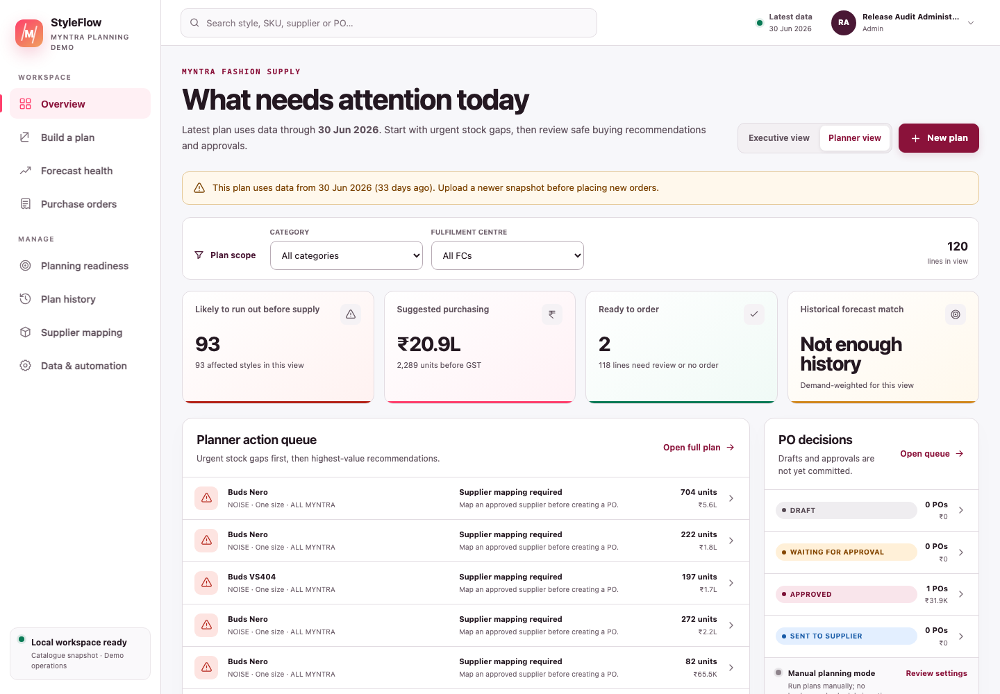

# Contents {.unnumbered}

- [About this guide](#about-this-guide)
- [Start here — the shortest useful walkthrough](#start-here-the-shortest-useful-walkthrough)
- [Install and start StyleFlow](#install-and-start-styleflow)
- [Sign in, change your password and sign out](#sign-in-change-your-password-and-sign-out)
- [Know the navigation and roles](#know-the-navigation-and-roles)
- [Create a plan from uploaded files](#create-a-plan-from-uploaded-files)
- [Create a plan from the live data connection](#create-a-plan-from-the-live-data-connection)
- [Maintain the vendor–supplier mapping sheet](#maintain-the-vendor-supplier-mapping-sheet)
- [Understand the PO mathematics](#understand-the-po-mathematics)
- [Review recommendations](#review-recommendations)
- [Use dashboards, Planning readiness, Forecast health and History](#use-dashboards-planning-readiness-forecast-health-and-history)
- [Create, approve and send a purchase order](#create-approve-and-send-a-purchase-order)
- [Record receipt and close the PO](#record-receipt-and-close-the-po)
- [Use Profile and Admin controls](#use-profile-and-admin-controls)
- [Use Data and automation](#use-data-and-automation)
- [Troubleshooting](#troubleshooting)
- [Daily role checklists](#daily-role-checklists)

# About this guide

StyleFlow is a local, PostgreSQL-backed application for Myntra-focused purchase-order planning. It calculates a style-level PO ask from sell-out, current inventory and open POs, shows the exact maths, and then controls the path from recommendation to draft, approval, supplier email and receipt.

This guide assumes no previous supply-planning or software knowledge. Follow the short walkthrough first, then return to the detailed section for the task you want to perform.

> **Safe-use rule:** the included files are for methodology validation and demonstration. Do not treat a displayed supplier, email address, price, tax identity or PO as an authorised real Myntra commercial instruction unless your organisation has governed and approved that source.

The attached NOISE workbook is a user-supplied methodology regression source; its operational facts are not independently certified by the app. The separate enriched demo uses a dated public Myntra catalogue snapshot with synthetic demand, inventory, NLC, suppliers and PO operations. Public selling price is not procurement NLC, and a marketplace seller is not automatically a vendor.

## Screenshot note

The screenshots were captured from the current local application on 2 August 2026 with a documentation-only Admin account. The plan uses the supplied NOISE methodology sample and deliberately incomplete/synthetic commercial data so blocks and checks are easy to see. Counts, dates and names illustrate that saved snapshot and will change with another upload. No private credential, database URL or API key is shown; the login’s public one-time local `admin/admin` bootstrap hint is intentional.

## Seven ideas to understand first

1. A **style** is the planning grain. The sales file decides which Style IDs are calculated.
2. **DRR** is total style sales divided by the number of unique sell-out dates across the whole selected dataset.
3. **DOH** is inventory divided by DRR. Only DOH strictly below the threshold enters the order calculation.
4. The PO ask is based on DRR, cover days, inventory and open POs—not on the forecast model.
5. A recommendation is not a purchase order. A draft is not approved. An approved PO is not sent until a separate send action succeeds or is evidenced.
6. Missing Model, MRP, NLC or supplier mapping blocks PO creation instead of being guessed.
7. Every purchase value is shown and stored in Indian rupees.

## Plain-language glossary

| Term | Meaning |
|---|---|
| Style ID | Product/style identifier used to join all four methodology sources. |
| Sell-out | Dated units sold. It supplies style sales and the unique-day denominator. |
| DRR | Daily run rate: style sales ÷ global unique selling days. |
| Inventory | Current units available in the uploaded inventory source, summed by style. |
| DOH | Days on hand: inventory ÷ DRR. |
| DOH threshold | Eligibility gate. The default is 80, and the rule is strictly `< 80`. |
| Cover days | Target number of DRR days to hold after subtracting current and open supply. Default: 45. |
| Open PO | Supply already ordered but not yet received; it reduces the new ask. |
| Signed ask | Rounded formula result, including negative values retained for audit. |
| Actionable quantity | Positive signed ask for a style that passes the DOH gate; otherwise zero. |
| Model | Product/model name from Style ID details. It is not the statistical forecast model. |
| MRP | Customer list price from style details. It does not value the procurement order. |
| NLC | Net landed/procurement unit cost in INR. It values recommendation and PO lines. |
| Supplier mapping | The real procurement supplier chosen for a style. It is not automatically a public listing seller. |
| Forecast accuracy | Backtest evidence about demand estimation. Useful for review, but not an input to the approved PO ask. |
| Snapshot | A saved copy of the four data sources and planning parameters. |
| Draft PO | Editable order preparation; no approval or supplier communication yet. |
| Issued / Sent | Email provider accepted the PO for live delivery, or a user recorded an authorised external send with evidence. This status is not supplier acknowledgement. |
| GRN | Goods receipt note/reference. |
| INR | Indian rupees, the application currency. |

# Start here — the shortest useful walkthrough

Use this path after the app and database are running:

1. Open `http://localhost:3000`.
2. On a new local database, sign in with username `admin` and password `admin`.
3. On **Profile & security**, enter current password `admin`, choose a private password of at least 10 characters, confirm it and save.
4. Open **Build a plan** and keep **Upload files** selected.
5. Choose **One bulk workbook**, then click **Use attached NOISE sample**. Keep cover days `45` and DOH threshold `80`.
6. Click **Validate files and calculate**.
7. In Recommendations, confirm the sample summary shows 30 unique selling days, 121 styles, 49 styles below the gate and 8,517 actionable units across 24 positive styles.
8. Open any row and read the DOH gate, sales ÷ days DRR, signed ask and actionable quantity.
9. Later, use **Review orders** in the left navigation to return to the latest saved plan available for review. Use **Plan history** for older versions or comparison.

That completes the calculation test. It does **not** create, approve or send a PO. Many sample rows intentionally lack an unambiguous procurement supplier and remain blocked until a valid supplier mapping is added.

# Install and start StyleFlow

## Requirements

- macOS with Homebrew;
- Node.js 20 or 22;
- PostgreSQL 16; and
- the unzipped `po-webapp` folder.

Check Node and Homebrew:

```bash
node --version
brew --version
```

## One-time local setup

Open Terminal and enter these commands from the repository folder. Replace `YOUR_MAC_USERNAME` in the environment file with the result of `id -un`.

```bash
brew install postgresql@16
brew services start postgresql@16
"$(brew --prefix postgresql@16)/bin/pg_isready"
"$(brew --prefix postgresql@16)/bin/createdb" po_ledger
npm ci
cp .env.example .env.local
id -un
openssl rand -hex 32
```

Open `.env.local` in a text editor and keep one clean copy of these settings:

```text
DATABASE_URL=postgresql://YOUR_MAC_USERNAME@127.0.0.1:5432/po_ledger
AUTH_SECRET=PASTE_THE_OPENSSL_VALUE_HERE
EMAIL_PROVIDER=preview
```

A normal Homebrew installation owned by your macOS user usually does not need a PostgreSQL password. Do not copy someone else’s user, password or port into this file.

Initialise and verify the database:

```bash
npm run db:init
npm run db:check
```

The successful check reports ten required application tables. Then start StyleFlow:

```bash
npm run dev
```

Open `http://localhost:3000`. Leave the Terminal window running. Press **Ctrl+C** in that Terminal to stop only the StyleFlow development server.

## Normal restart later

```bash
cd /path/to/po-webapp
npm run db:check
npm run dev
```

## Environment variables

| Variable | Required | Purpose |
|---|---|---|
| `DATABASE_URL` | Yes | PostgreSQL connection. The implemented remote path currently supports Neon-hosted PostgreSQL. Generic RDS, Supabase and other hosted providers have not been configured or verified. |
| `AUTH_SECRET` | Yes | Signs user sessions. Generate a different random value for each environment. |
| `BOOTSTRAP_ADMIN_USERNAME` | Neon/deployment first init | Username for the first administrator. |
| `BOOTSTRAP_ADMIN_PASSWORD` | Neon/deployment first init | Initial password; a remote/production bootstrap requires at least 12 characters. |
| `BOOTSTRAP_ADMIN_DISPLAY_NAME` | Optional | First administrator’s display name. |
| `BOOTSTRAP_ADMIN_EMAIL` | Optional | First administrator’s work email. |
| `EMAIL_PROVIDER` | Yes for email flow | `preview` sends nothing; `resend` enables live provider delivery when configured. |
| `EMAIL_FROM` | Resend | Verified sender identity, for example `StyleFlow PO Desk <purchasing@company.com>`. |
| `EMAIL_REPLY_TO` | Optional | Inbox that receives supplier replies. |
| `RESEND_API_KEY` | Resend | Secret provider API key. Never commit or screenshot it. |
| `EMAIL_FORCE_TO` | Recommended during live testing | Redirects all provider messages to controlled test recipients. |
| `AUTOMATION_SCHEDULER_CONNECTED` | Optional | Set true only after a real external scheduler exists. |

# Sign in, change your password and sign out

## First local login

An empty local database creates one convenience account:

```text
Username: admin
Password: admin
```


*Figure 1 — Current protected-workspace login. The local bootstrap hint is visible, but the password field is empty.*

After sign-in, StyleFlow redirects to **Profile & security**. The rest of the app is locked until the temporary password is changed.

1. Leave the prefilled display name or enter your real test identity.
2. Optionally enter a work email.
3. Enter `admin` in **Current password**.
4. Enter and confirm a new password containing 10–200 characters.
5. Do not use `admin` or your username as the new password.
6. Click **Save profile**.

The session is refreshed automatically after the password change.

## Normal sign-in

Enter your username and private password. After five unsuccessful attempts, the account is locked for 15 minutes. Ask an administrator to reset a temporary password only when you cannot recover access through the normal process.

## Sign out

Open the avatar/account button at the top right and choose **Sign out**. On mobile, open **More**, then **Sign out**.

> If `admin/admin` does not work, do not repeatedly retry it. The database may already contain users, the password may already have been changed, or the account may be temporarily locked. See [Troubleshooting](#troubleshooting).

# Know the navigation and roles

| Navigation item | What it is for |
|---|---|
| Overview | Executive and Planner dashboards for the latest plan and PO workload |
| Build a plan | Upload sources or filter the latest connected snapshot |
| Review orders | Open the latest reviewable saved plan and continue recommendation decisions |
| Planning readiness | One control tower for data, mapping, approval and delivery gates |
| Supplier mappings | Maintain Style ID–supplier relationships and commercial PO fields |
| Forecast health | Accuracy, WAPE, bias, model and data-evidence review |
| Purchase orders | Draft, approval, email/issue, receipt and close workflow |
| Plan history | Open older saved plan versions or compare two versions |
| Data & automation | Source readiness, manual rerun and schedule/approval settings |
| Profile & security | Display name, email and password |
| Workspace admin | Admin-only user management and system readiness |
| Access control | Admin-only page permissions by role and individual user |

The global search accepts product, style, SKU, supplier or PO number.

On desktop, click the circular arrow on the right edge of the left menu to minimise it to an icon-only rail. Click the same visible arrow to expand the labels again. StyleFlow remembers the choice on that device and gives the page the freed width. Hover an icon to read its label.

## Role guide

| Role | Can do |
|---|---|
| Admin | Manage users/readiness and operate workflows, including warned and audited self-approval. |
| Planner | Create plans and POs; edit/submit; preview/email approved POs; mark external sends. |
| Approver | Approve standard-value POs or return/cancel approval-stage POs. |
| Senior approver | Approve standard and high-value POs. |
| Receiver | Record accepted delivery quantities against sent POs. |
| Viewer | Read-only access. |

For a complete lifecycle test, separate Planner and Approver accounts are recommended but optional. If one authorised approver performs both steps, StyleFlow warns them and marks the approval event as self-approval.

# Create a plan from uploaded files

Route: **Build a plan**.


*Figure 2 — Current plan builder. Choose Upload files or Live data connection; upload one bulk workbook or switch to four separate sources.*

## Option 1 — one bulk workbook

1. Select **Upload files**.
2. Select **One bulk workbook**.
3. Choose one `.xlsx` or `.xlsm` file, or click **Use attached NOISE sample**.
4. Enter a meaningful plan name.
5. Keep or change **PO cover days** and **DOH review threshold**.
6. Click **Validate files and calculate**.

The workbook must contain these four sources:

| Source sheet | Required fields |
|---|---|
| Sell-out | `order_Month`, `style_id`, `qty` |
| Current Inventory | `style_id`, `inv_units_q1` |
| Open PO | `style_id`, `pending_qty` |
| Style ID details | `Style Id`, `Model`, `MRP`, `NLC` |

The parser understands the exact supplied tab names and common alternatives. One recognised source of each type is required. Do not also add separate files while bulk mode is selected.

## Option 2 — four separate files

1. Select **Upload files**.
2. Select **Separate source files**.
3. Add exactly one sell-out, inventory, open-PO and style-details file.
4. Each file may be CSV or XLSX.
5. Use the **Download template** link beside each input when starting from scratch.
6. When all four sources are present, click **Validate files and calculate**.

Minimum and recommended columns:

| File | Required | Recommended for an operable PO |
|---|---|---|
| Sell-out | `order_Month, style_id, qty` | `brand, article_type, master_category` |
| Current inventory | `style_id, inv_units_q1` | warehouse ID/name and product attributes |
| Open PO | `style_id, pending_qty` | `vendor_name, estimated_shipment_date, po_status, warehouse_id` |
| Style details | `Style Id, Model, MRP, NLC` | `Vendor, Contact_Email, Supplier_SKU, HSN_Code, GST_Rate, Supplier_GSTIN, Supplier_State, Lead_Time_Days, Payment_Terms, Incoterms, MOQ, Pack_Size` |

The header-only open-PO file is valid when nothing is pending. Keep the required headings and no data rows; do not invent a zero-quantity order.

## File rules

- Maximum file size: 15 MB.
- Maximum combined data rows: 100,000.
- Sell-out dates accept `YYYYMMDD` or `YYYY-MM-DD`.
- Quantities must be safe whole numbers.
- MRP and NLC must be non-negative numeric values; use INR.
- GST rate, when supplied, must be 0–100. Lead time, MOQ and pack size must be non-negative whole numbers.
- Header matching ignores letter case and common spaces, underscores, hyphens, periods and slashes.
- Repeated sales, inventory and open-PO rows are summed, not deleted.
- A conflicting Model/MRP/NLC record for the same style stops the import.
- A workbook plus separate files in the same request is rejected.
- Missing inventory/open-PO matches are reported instead of silently hidden.

## Why supplier fields matter

The supplied methodology calculates quantity without a supplier, but StyleFlow will not invent who should receive a commercial PO. A draft-ready style needs one real, unambiguous supplier and a positive NLC in INR. Add `Vendor` to Style ID details or supply a single consistent vendor through the recognised source fields. `Contact_Email` gives the draft a default supplier recipient; it can also be edited while the PO is Draft.

The expanded style-details template can also prefill HSN, GST rate, supplier GSTIN/state, lead time, payment terms, Incoterms, MOQ and pack size. These values support PO preparation and review. Under the approved New PO method, MOQ and pack size do **not** modify the DRR/DOH/cover quantity; any quantity change remains a separate planner override with a reason.

If no supplier exists, the recommendation displays **Supplier mapping required**. Use **Add supplier & raise PO** to enter or select the legal supplier and positive INR NLC without leaving the plan. Tax, email and dispatch details are optional at this point and remain visible as send-readiness work on the draft. This is a safety control, not a calculation failure.

## What happens after calculation

StyleFlow:

1. validates every source;
2. saves a new planning snapshot;
3. applies the versioned New PO methodology;
4. computes forecast evidence separately;
5. opens the recommendation workbench; and
6. creates no PO until a planner deliberately selects and confirms lines.

# Create a plan from the live data connection

“Live data connection” currently means the latest authoritative inbound/root **StyleFlow planning warehouse** snapshot in PostgreSQL. It is not a live Myntra website or production-system API. A plan previously derived through Live data or Automation is not silently used as the next source anchor.

## Before using it

Upload and calculate at least one valid source snapshot first. If no snapshot exists, the connection panel explains that an upload is required.

## Steps

1. Open **Build a plan**.
2. Select **Live data connection**.
3. Confirm the connection name, source plan and data-as-of date.
4. Set the sell-out start and end date.
5. Optionally filter Brand, Style ID, Supplier, Product, Category and Article type. Warehouse appears only when sell-out itself has genuine fulfilment-centre grain.
6. Review the selected-row/style summary.
7. Keep or change the shared cover-days and DOH-threshold controls.
8. Click the connected-plan action in that panel.

Leaving a filter empty means “all available values”. Search within long filter lists and clear a selection when you want the full set again.


*Figure 3 — Current Live data connection. Confirm the source snapshot, data-as-of date, row counts and selected period before applying product/supplier filters.*

## Important filter behaviour

- The date range filters sell-out and therefore changes both the style universe and the global unique-day denominator.
- Product/category/brand selections resolve to Style IDs first, so an inventory row does not need to repeat every product field.
- Supplier selection chooses which commercial supplier rules apply.
- All pending open-PO quantities for the selected styles remain included, even if another supplier placed them. This prevents a vendor filter from hiding existing supply and causing a double-buy.
- Warehouse filtering is available only when every sell-out row contains a real, non-network warehouse. The supplied methodology workbook has network-level sell-out, so StyleFlow hides the warehouse filter and retains all matching inventory and open supply. This prevents total-network demand from being compared with only one warehouse’s stock.
- StyleFlow saves the filtered selection as a new plan batch. It does not overwrite the original source snapshot through the intended workflow.

# Maintain the vendor–supplier mapping sheet

Route: avatar menu → **Supplier mappings**. Planner and Admin roles can edit; other permitted roles see the same governed sheet read-only.


*Figure 3A — Current mapping master. Read the status and issue text before editing; “mapped” means the required fields are present, not that the supplier has been independently certified.*

## First use after creating a plan

1. Open **Supplier mappings**.
2. Confirm the **Latest source plan** shown near the top.
3. Click **Bring in plan styles**. StyleFlow inserts only relationships missing from the mapping master and leaves every existing row unchanged.
4. Select **Unmapped** to assign real, authorised procurement suppliers.
5. Select **Incomplete** to fill the listed execution fields.
6. Recreate or rerun the plan when the recommendation batch itself must carry the new mapping and reproducible mapping fingerprint. An already generated plan is never silently rewritten. For one blocked line, you may instead use **Add supplier & raise PO**; StyleFlow applies the selected current mapping revision to that draft only and keeps the original plan unchanged.

## Understand the three states

| State | Meaning | Action |
|---|---|---|
| Mapped / dispatch details complete | Supplier, positive INR NLC, supplier SKU/email, HSN/GST, GSTIN/state, lead time, MOQ and pack size are present. | Verify the business truth before execution. |
| Incomplete | A supplier is named but at least one full-mapping field is missing. A real supplier plus positive INR NLC can still be enough for an editable draft. | Follow the missing-field list and complete tax, communication and dispatch details before sending. |
| Unmapped | No non-placeholder supplier is assigned. | Add an authorised procurement supplier in the sheet, or resolve it while raising one PO; never copy a public seller merely to clear the block. |

## Resolve a supplier while raising one PO

1. In **Review what to order**, find a positive recommendation marked **Map supplier**.
2. Click **Add supplier & raise PO**.
3. Select the intended mapping when more than one supplier is available; StyleFlow never guesses between suppliers.
4. Confirm the legal supplier, positive INR NLC and PO quantity. If quantity changes, enter an override reason.
5. Optionally add HSN/GST, GSTIN/state, supplier email, lead time, payment terms, Incoterms, MOQ and pack size. Supplied MOQ and pack rules are enforced.
6. Click **Save supplier & create draft PO**.

StyleFlow saves the chosen mapping revision and creates one editable draft in a single controlled action. It does not approve or email the PO. The original recommendation, DRR, DOH, signed ask and saved plan remain unchanged; any quantity override is recorded separately. If another user updates the mapping first, reload its current revision before retrying.

## Edit one mapping

1. Search by Style ID, product or supplier; optionally filter Brand, Category or Supplier.
2. Open the row and edit only governed values.
3. Enter all rupee cost as NLC in INR.
4. Save. If another user changed the row after you loaded it, StyleFlow rejects the stale revision. Close, reload and reapply the intended change.

One style may have more than one supplier relationship. When uploaded data names a supplier explicitly, the matching relationship applies. With no explicit supplier, StyleFlow applies a mapping only when exactly one unambiguous supplier exists.

## Import or export the sheet

- Click **Export sheet** for an XLSX copy of the current master and supported headings.
- Edit without changing Style IDs or inventing legal/tax data.
- Click **Import sheet** and choose CSV/XLSX. The result reports accepted, created, updated and collapsed duplicate rows.
- Fix any row-specific validation error and import again. A bulk import uses the same email, GSTIN, HSN, GST, integer and positive-value rules as the editor.

Exported text that begins like a spreadsheet formula is neutralised for safety. Import/export is a maintenance route, not a substitute for commercial approval.

# Understand the PO mathematics

This is the quantity source of truth. Forecast accuracy is discussed separately later.

## Step 1 — count unique selling days

Count distinct `order_Month` dates across all selected sell-out rows:

$$
UniqueDays=countDistinct(order\ dates)
$$

The same number is used for every style.

## Step 2 — calculate DRR

$$
StyleSales=\sum qty
$$

$$
DRR=StyleSales\div UniqueDays
$$

Example: 3,265 units over 30 unique dates gives `108.8333 units/day`.

## Step 3 — calculate DOH and apply the gate

$$
Inventory=\sum inv\_units\_q1
$$

$$
DOH=Inventory\div DRR
$$

With inventory 461 and DRR 108.8333, DOH is about 4.235 days. At the default threshold, `4.235 < 80`, so the style is eligible.

If DRR is zero, DOH is `NA` and the style is excluded. Exactly 80 days is also excluded because the rule is strictly below 80.

## Step 4 — subtract open POs and round

$$
OpenPO=\sum pending\_qty
$$

$$
SignedAsk=ExcelRound((DRR\times CoverDays)-Inventory-OpenPO,0)
$$

The default cover is 45 days. Excel-compatible rounding sends exact halves away from zero:

- `91.5 → 92`;
- `4,436.5 → 4,437`; and
- `−49.5 → −50`.

## Step 5 — create the actionable quantity

$$
ActionableQty=\begin{cases}
\max(0,SignedAsk),&DOH<Threshold\\
0,&otherwise
\end{cases}
$$

A negative signed ask remains visible in the audit explanation, but no negative PO can be created.

## Supplied-workbook check

With cover 45 and threshold 80, `Noise_113.xlsx` should show:

| Check | Expected result |
|---|---:|
| Unique selling days | 30 |
| Styles in sell-out | 121 |
| Styles below 80 DOH | 49 |
| Positive actionable styles | 24 |
| Positive actionable units | 8,517 |
| Style 36627115 | 4,437 units |
| Style 41280678 | signed −50, actionable 0 |

If these figures differ, first confirm that the full workbook was used and the two controls are still 45 and 80.

## Forecast evidence is not this formula

Forecast health reports:

$$
WAPE=total\ absolute\ forecast\ error\div total\ actual\ demand
$$

$$
HistoricalMatch=\max(0,100\%-WAPE)
$$

Bias shows whether the model tended to run high or low. Use these metrics to question uncertainty, demand changes or weak history. Do not use them to manually “correct” the approved formula without an authorised planning decision and recorded reason.

# Review recommendations

The calculation opens **Review what to order**.


*Figure 4 — Current recommendation workbench: strict DOH eligibility, positive signed ask, master-data blocks and INR impact are visible before selection.*

## Read the summary first

For a style-cover plan, focus on:

- unique selling days;
- styles below the DOH gate;
- actionable styles and units;
- blocked actionable styles;
- proposed INR value; and
- forecast evidence as a separate signal.

## Understand the decision states

| State | Meaning |
|---|---|
| Outside DOH gate | DOH is not strictly below the threshold; no order under this policy. |
| Stock covers target | Signed ask is zero/negative; actionable quantity is zero. |
| Ready to order | Passes DOH gate, has positive quantity and has complete supplier/product/cost master data. |
| Complete style master | Model or MRP is missing; correct the style master before creating a PO. |
| Add missing cost | NLC is missing. Use **Add supplier & raise PO** to enter a positive INR NLC with the supplier. |
| Correct source data — inventory missing | No inventory row matched the sold style. The audit calculation shows a zero, but PO creation is blocked until current stock is governed. |
| Map supplier | No real, applicable supplier mapping. Use **Add supplier & raise PO**, then enter or select the legal supplier and positive INR NLC. |
| Correct source data | Negative sales, inventory or open-PO total; cannot create a PO. |
| Already ordered | A live PO already protects the same plan batch/warehouse/style recommendation, regardless of supplier. |

## Open the explanation drawer

Click a product or action. Read it in this order:

1. **Recommended action** — eligibility and actionable result.
2. **Style and supplier master** — Style ID, Model, MRP, NLC, supplier and readiness.
3. **Inventory timing** — today, projected stockout and expected receipt.
4. **Documented DRR and PO calculation** — every number from sales through actionable quantity.
5. **Commercial impact** — estimated pre-GST PO cost and risk estimates.
6. **Issues to decide** — blocking and non-blocking exceptions.
7. **Forecast and data evidence** — supporting model metrics; it does not change the formula.


*Figure 5 — Current calculation drawer. Read the strict DOH gate, DRR, cover target, stock, open PO, Excel-style rounding and actionable quantity in one audit trail.*

## Select and override carefully

1. Start in **Ready to order**.
2. Select only the lines you own and have reviewed.
3. Check the proposed quantity and NLC.
4. If you change quantity, choose a reason. The selected quantity becomes the draft quantity.
5. Preview grouping, units and value before creating drafts.

Missing supplier, style metadata, NLC or invalid negative source data cannot be acknowledged away. Other critical operational warnings can require an explicit review acknowledgement, but that acknowledgement records awareness—it does not resolve the risk.

## Create draft POs

1. Click **Preview N draft PO**.
2. Confirm supplier, warehouse, lines, units and pre-GST INR value.
3. Add required override reasons and any permitted risk acknowledgement.
4. Click **Create N draft PO**.

StyleFlow groups lines by supplier and warehouse. Creating the draft does not approve it, email anyone, reserve budget or update stock.

# Use dashboards, Planning readiness, Forecast health and History

## Executive view


*Figure 6 — Current Executive view. Use the active database figures; the captured NOISE snapshot is illustrative.*

Use it for a one-minute brief:

- proposed investment is recommendation quantity × NLC before GST;
- awaiting decision is Draft plus Waiting-approval PO grand totals;
- committed is Approved, Sent and Part-received PO grand totals;
- received/closed/cancelled are not current open commitment; and
- exposure is an estimate, not guaranteed lost revenue or profit.

Do not add every card together: recommendation value and PO value can describe different stages of the same need.

## Planner view



*Figure 7 — Current Planner view showing the action queue, safe-to-order count and separate PO decisions.*

Use filters, start with blocked/high-impact lines, then open the full plan or PO queue. For a New PO plan, use the recommendation’s DOH and signed-ask evidence as the buying policy.

## Review orders

Use **Review orders** in the permanent left navigation for the current recommendation task. It opens the latest saved plan that is available for review, so you can continue filtering lines, reading the calculation evidence, resolving supplier details and creating drafts without first finding the plan in History.

This shortcut does not replace version history and does not merge plans. Use **Plan history** when you need to reopen an older saved plan, inspect its original evidence or compare two versions.

## Planning readiness


*Figure 7A — Current Planning readiness view. It summarises the next actions without hiding which underlying screen owns the work.*

Use this screen for the end-to-end morning check:

1. Read **Current operating state** and the number of clear gates.
2. In **What needs attention next**, open the first unresolved action; actions are ordered from source quality through execution.
3. In **Decision gates**, check the named owner and definition of done for Data, Commercial, Approval and Execution.
4. In **Source and mapping health**, confirm row counts, freshness and incomplete/unmapped relationships.
5. Use the direct links to Data & automation, Supplier mappings, Purchase orders or Build a plan. Do not try to fix a block by interpreting the summary alone.

**Blocked** means a non-overridable condition prevents safe progress. **Review** means a human decision or follow-up is waiting. **Clear** means no current exception is open; it does not certify the external business truth or future demand.

## Forecast health


*Figure 8 — Current Forecast health view. Accuracy, historical match, tendency and model mix are supporting evidence; they do not replace the New PO formula.*

Read WAPE, historical match, bias and data grade together. A high match on short or incomplete history can still be weak evidence. A lower match does not silently change the PO ask; it tells the planner to review the business context.

## Plan history


*Figure 9 — Current History view. Uploaded and filtered New PO runs create distinct, comparable records with linked PO counts.*

Use **Plan history** for versions other than the latest reviewable plan: open a prior plan to reproduce its evidence, or select two plans for comparison. For normal work on the current recommendation set, use **Review orders**. History is retained intentionally. The application workflow creates new versions, although the database does not yet enforce a fully immutable ledger.

# Create, approve and send a purchase order

## Prepare separate test users first

For a separated maker-checker test:

1. As Admin, open the avatar menu → **Workspace admin**.
2. Create a Planner and a Senior approver with different usernames and temporary passwords of at least 10 characters.
3. Sign in as each new user once and change the temporary password.
4. Use Planner for drafting/submitting and Senior approver for approval.

The default senior threshold is ₹2,50,000. A standard Approver cannot approve a PO at or above it. An authorised Approver, Senior Approver or Admin can approve their own PO after a visible self-approval warning.

## Local sandbox supplier mapping for the NOISE sample

The unmodified attached workbook is primarily a calculation regression and does not provide a governed supplier for every positive style. The recommended local test keeps most lines usable while deliberately leaving some for the inline resolver:

1. Create the NOISE plan, then open avatar menu → **Supplier mappings**.
2. From the project terminal, run `npm run sample:seed-noise`. This is a read-only preview. It should find 121 distinct recommendation styles and target exactly 97 mapped (80.17%) with 24 unresolved (19.83%). Missing styles are included in the preview and will be inserted without overwriting existing mappings.
3. Only when that exact guarded scope is shown, apply the synthetic demo seed:

   ```bash
   STYLEFLOW_DEMO_SEED_CONFIRM=styleflow-demo-noise-80-v2 npm run sample:seed-noise -- --apply
   ```

4. Reload the plan. Most sample relationships now have complete demo mappings; the retained relationships remain unresolved, and any eligible recommendation using one shows **Map supplier**.
5. On one retained line, click **Add supplier & raise PO**, enter or select the synthetic legal supplier and positive INR NLC, review the quantity, and create the editable draft. Complete tax and dispatch fields on the draft before sending.

The seed refuses remote databases, never enriches manual/imported/inline-resolution mappings and uses synthetic, non-deliverable contacts, INR costs and tax identities. Materialisation and enrichment happen in one audited transaction; a rerun at the exact target changes nothing. Do not use a public marketplace seller as procurement supplier unless it is genuinely governed as such. A generated high-value PO still needs a Senior Approver or Admin, who may be the creator with a warned and audited self-approval.

For a portable workbook-only legacy sandbox, duplicate `Noise_113.xlsx`—never overwrite the regression original—and add `Vendor`, `Contact_Email` and any desired commercial columns in **Style ID details** before upload. Prefer the in-app mapping and inline resolver for normal testing because they preserve mapping revisions and audit provenance.

## Stage 1 — Draft

Open **Purchase orders**, then the draft.

1. Check the expected delivery date. A generated draft will not use a date earlier than its India order date plus saved supplier lead time; an edited date must be a valid date no earlier than the PO date or today.
2. Check supplier email.
3. Complete supplier and buyer GSTIN, states, place of supply, ship-to and bill-to.
4. Add HSN to every line.
5. Check quantity, NLC, GST, freight, discount and notes.
6. Click **Save changes**.
7. Click **Submit for approval**.

For a local sandbox, use values visibly labelled `TEST` or `NOT REAL`; never copy them to a real PO. StyleFlow checks presence and positivity, not legal validity.

If StyleFlow says the PO changed in another session, refresh the PO and review the newest values before trying again. The app uses a revision number on every edit, status change and receipt so a stale browser tab cannot silently overwrite newer work.

## Stage 2 — Waiting approval

Sign out and sign in as the separate Approver/Senior approver.

- **Approve PO** records the signed-in approver and does not contact the supplier.
- **Return to draft** lets the planner fix the PO and requires a reason.
- **Reject and cancel** stops the PO while retaining history.

If a self-approval warning appears, confirm only when that exception is intended; the approval event will record it. If senior approval is required, use `senior_approver` or Admin, or lower the threshold only through an authorised policy decision.

## Stage 3 — Approved and ready to send


*Figure 10 — Current draft PO detail. Commercial inputs, workflow steps, supplier-email panel and ready-to-send checks are kept together.*

The readiness checklist requires:

- positive NLC on every line;
- expected receipt date;
- buyer and supplier GSTIN;
- ship-to and place of supply;
- HSN on every line; and
- recorded approval.

For Planner users, any missing item remains a hard dispatch block: return the PO to Draft, complete it, resubmit and obtain approval again.

Dispatch readiness applies when the supplier can actually be contacted. Local preview-mode test sends and Resend tests redirected by `EMAIL_FORCE_TO` remain available with missing readiness details and do not require a pre-generated preview; they cannot issue the PO.

An Admin still sees **Email approved PO** and **Mark as sent outside StyleFlow** on an Approved PO with missing readiness details. This is an exception path, not a repair. Before either dispatch action, the Admin must:

1. review the exact missing-field list;
2. tick the explicit readiness-override checkbox; and
3. enter a meaningful reason of 10–1,000 characters and at least two words.

StyleFlow records the missing fields, reason and signed-in Admin identity in the PO/email audit trail. The override does not fill the missing fields and does not bypass Approved status, recipient validation, provider configuration/test redirects, idempotency or uncertain-delivery controls. Prefer correcting the draft whenever operationally possible.

## Safe email preview — default local behaviour

With `EMAIL_PROVIDER=preview`:

1. Sign in as Planner or Admin.
2. On the approved PO, click **Prepare supplier email**.
3. Check **To**, optional **CC**, subject and buyer message.
4. Optionally click **Generate preview**. A preview is useful for review but is not a gate for this non-delivering test.
5. If generated, read the rendered PO in the right-hand preview: PO/delivery dates, delivery and billing addresses, payment terms, Incoterms, place of supply, both GSTINs, HSN and GST by line, freight, discount, tax and INR grand total.
6. Review **Delivery history**. Preview remains available even when readiness details are missing.
7. Confirm the compact **Preview mode · no external delivery** context, then click **Send email**. Nothing leaves StyleFlow and the PO stays Approved; no readiness override is required.

Preview activity is audited. It is safe for local testing because it does not contact the supplier.

## Live Resend delivery — only after configuration

Set these in `.env.local`, then restart `npm run dev`:

```text
EMAIL_PROVIDER=resend
EMAIL_FROM=StyleFlow PO Desk <purchasing@your-verified-domain.com>
EMAIL_REPLY_TO=buying-team@your-company.com
RESEND_API_KEY=re_...
EMAIL_FORCE_TO=your-controlled-test-address@company.com
```

Verify the sender domain in Resend first. Keep `EMAIL_FORCE_TO` during acceptance testing.

Then perform a controlled redirect test:

1. Optionally generate the preview. Redirected tests are safe without it because `EMAIL_FORCE_TO` prevents supplier contact.
2. Confirm the banner says the test redirect is active.
3. Confirm the test-redirect context, then click **Send email**.
4. Wait for the result; do not double-click. The provider call stops after 15 seconds.
5. A successful redirected test records its provider message ID but correctly keeps the PO Approved because the supplier was not contacted.
6. A provider failure is recorded and also leaves the PO Approved.

If StyleFlow reports that delivery could not be confirmed, **do not retry**. The request changes from Processing to **Uncertain** because the provider might already have accepted it. Ask an Admin to check the Resend dashboard and use **Workspace admin → Email delivery reconciliation** with a 10–1,000 character evidence note. The Admin can mark provider acceptance as Sent or, only after verifying no provider acceptance, release a safe retry.

Remove `EMAIL_FORCE_TO` only after authorised owners have verified recipients, sender, reply path, content, approval and audit behaviour and have approved real supplier contact. For a non-redirected Resend send, generate a fresh preview after the PO's latest change. The server accepts only that preview's opaque ID from the same signed-in user and only while recipients, CC, subject and buyer message still match; editing any of them requires another preview. A successful non-redirected Resend **provider acceptance** then records its message ID and moves the PO from Approved to Sent. This means Resend accepted the request; it is not proof of inbox delivery or supplier acknowledgement. StyleFlow prevents a second Processing, Uncertain or Sent supplier dispatch for the same PO.

## Mark as sent outside StyleFlow

Use this only when the approved PO was genuinely sent through another authorised channel.

1. Confirm readiness passes. If it does not, only an Admin can continue through the explicit audited override described above.
2. Click **Mark as sent outside StyleFlow**.
3. Enter evidence: channel, recipient, date/time and traceable thread/reference.
4. When an Admin override is required, separately tick the override checkbox and enter its business reason; external-send evidence is still required.
5. Confirm the action.

This moves the PO to Sent without claiming that StyleFlow emailed it. Do not use it as a shortcut around provider setup. A readiness override never substitutes for evidence that an external send actually occurred.

# Record receipt and close the PO

Only an Admin or Receiver can record receipt, and only for Sent or Part-received POs.

1. Open the PO and click **Record delivery**.
2. Enter positive whole-unit accepted quantities, not merely shipped quantities. Enter each PO line at most once per receipt.
3. Do not exceed the remaining order balance.
4. Enter a real receipt date no later than today and no earlier than the PO date; add GRN/reference, supplier invoice and exception note when available.
5. Click **Record accepted quantities**.

A partial amount moves the PO to **Part received**. Receiving every remaining unit moves it to **Received**. After invoice and receipt checks, sign in as Planner or Admin and click **Close order**; the Receiver role records goods receipt but does not close the commercial order.

Recording receipt does not update sellable inventory. The next inventory upload/connected snapshot must reflect the physical stock change.


*Figure 11 — Current PO queue. Use status tabs to separate approval, sent, received and cancelled work.*

# Use Profile and Admin controls

## Profile & security

Open the avatar menu → **Profile & security**.

- Update display name and optional work email.
- Change password by entering the current password and a new 10–200-character password.
- Username and role are controlled by an administrator.
- Your display name is used in PO and planning audit history.

## Workspace admin

Admin only. The administration area has four capabilities: system readiness, email-delivery reconciliation when needed, user administration, and page access control.


*Figure 12 — Current Admin control centre. PostgreSQL, source freshness, email mode, authentication readiness and named-user controls are visible without exposing credentials.*

### System readiness

Click **Refresh checks** and review:

- PostgreSQL connection, response time and fourteen-table required schema;
- latest planning snapshot, data age and row counts;
- email provider: Preview only, Delivery enabled or Setup needed;
- test-redirect state;
- signed-session readiness;
- active user/admin counts; and
- temporary-password warnings.

“Connected data” here still means the latest StyleFlow PostgreSQL snapshot, not a direct Myntra API. The screen never reveals database URLs, API keys or password hashes.

### Email delivery reconciliation

This panel appears when a live provider request ended without trustworthy confirmation. It is a safety queue, not a retry button.

1. Open the matching message in the Resend provider dashboard.
2. Enter a 10–1,000 character note describing the message ID, status and evidence checked.
3. Choose **Provider accepted · mark sent** only when acceptance is verified; the record becomes Sent and an Approved PO moves to Sent.
4. Choose **Verified not sent · release retry** only when the provider proves it did not accept the request; the failed claim is released so a fresh send can be prepared.

Never release a retry merely because the PO is urgent. A duplicate PO email can create a duplicate supplier commitment.

### Users

An Admin can:

- create a named user with a temporary password;
- set display name, work email and role;
- suspend/reactivate a user;
- set a new temporary password; and
- save access changes.

Role, password and active-status changes invalidate the user’s existing sessions. An Admin cannot suspend/demote themselves or remove the final active administrator.

### Access control

Open **Administration → Access control** in the left menu, or **Workspace admin → Access control**.

1. Find the person in the **Users and access** directory. Each row shows their username, role and current access summary.
2. Click **Manage access** on that user’s row. A focused access matrix opens for that person only.
3. For each page, choose **Use role default**, **Allow** or **Deny**, then review the resulting **Effective access**.
4. Optionally add a change note, then click **Save access**. Close the matrix when finished.
5. Use **Role defaults** only when the normal policy for everyone in a role needs to change.
6. If another administrator saved first, reload the latest revision and apply the intended changes again.

Changes apply on the user’s next page or API request. A denied link disappears from desktop and mobile navigation, and typing the URL directly is also rejected or redirected to the first permitted area. Profile and sign-out remain reachable. Existing operational rules still apply: page access does not by itself let a Viewer approve a PO or a Planner administer users.

The **Admin & access control** row is locked: it is always available to Administrators and unavailable to non-Admin roles or personal overrides. This prevents accidental lockout or delegation of access administration.

# Use Data and automation


*Figure 13 — Current Data health & automation view. The warning makes clear that saved cadence does not start a background job on the local computer.*

## Source readiness

Confirm that sell-out, inventory, open POs and style/supplier master describe the intended snapshot. Use **Replace data** or Build a plan when a fresher source is available.

## Controls

- cadence and preferred time are stored in IST;
- event name and uplift describe an explicit planning scenario;
- senior approval threshold controls high-value approval routing; and
- optional auto-draft creates only qualifying drafts, never approval or sending.

Save changes before **Run planning now**. A manual run creates another plan version from the latest snapshot. Repeated clicks create additional records, so click once and wait.

> **Local limitation:** saving Daily or Weekly does not start a background job. A deployment scheduler or Vercel Cron must call the idempotent run endpoint later.

# Troubleshooting

## `database "po_ledger" already exists`

This is not a failure. Do not recreate or delete it. Continue with:

```bash
npm run db:init
npm run db:check
```

## PostgreSQL asks for a password or authentication fails

Your `.env.local` is pointing to a user/port/password different from the PostgreSQL server you started.

```bash
id -un
"$(brew --prefix postgresql@16)/bin/pg_isready"
```

For a normal user-owned Homebrew database on port 5432, use:

```text
DATABASE_URL=postgresql://YOUR_MAC_USERNAME@127.0.0.1:5432/po_ledger
```

Remove any copied `mosaic`, `styleflow`, old port or unknown password. Restart the app after editing `.env.local`.

## `brew services start` fails

```bash
brew services stop postgresql@16
brew services start postgresql@16
"$(brew --prefix postgresql@16)/bin/pg_isready"
```

Do not run the PostgreSQL service as `root`.

## `bad interpreter: Operation not permitted` after unzipping

For a trusted copy of this project, run from its folder:

```bash
xattr -dr com.apple.quarantine .
npm ci
```

Then run `npm run dev` again.

## `admin/admin` does not work

- The convenience account is created only when a **local** `app_users` table is empty.
- If the password was already changed, use the changed password.
- Five failed attempts lock the account for 15 minutes.
- If users already exist, sign in with one of those accounts or have an Admin reset a temporary password.
- Running `db:init` again does not overwrite existing users.

## The app keeps returning to Profile

The account still has a temporary password. Enter the current temporary password, choose a 10+ character private password, confirm it and save.

## Bulk workbook is rejected

Check that it contains exactly one recognised sell-out, inventory, open-PO and style-details source, and that every required heading is present. Use the included sample to confirm the importer works before fixing your workbook.

## Separate upload button remains disabled

All four file inputs are required. The open-PO file can be header-only, but it must still be supplied.

## Live data connection says no source exists

First upload and calculate one complete source snapshot. Then return to Build a plan and select Live data connection.

## Live filters return no rows

Broaden the date period or clear product/brand/style filters. The selected date period must contain sell-out rows; it defines the style universe.

## A style cannot be selected

Check the displayed state:

- **Outside DOH gate** or **Stock covers target** means actionable quantity is zero.
- **Map supplier** means add one real applicable supplier mapping. Use **Add supplier & raise PO** when you want to resolve it and create one draft without rerunning the plan.
- **Complete style master** means Model or MRP is missing and must be corrected in the source master.
- **Add missing cost** means NLC is missing; use **Add supplier & raise PO** to provide it with the supplier.
- **Correct source data** with a missing-inventory explanation means the sold style has no matched inventory row; add/confirm governed stock before drafting.
- **Correct source data** means a negative aggregate must be fixed.
- **Already ordered** means an active PO protects the same key.

These blocks cannot be bypassed by acknowledging risk.

## Approval is rejected

- Self-approval is allowed for authorised approvers, with a visible warning and an explicit audit marker.
- A PO at/above the threshold needs a Senior Approver or Admin; self-approval is warned and explicitly audited.
- Only a Waiting-approval PO can be approved.

## Supplier email has no default recipient

Return the PO to Draft and enter a valid supplier email, or add `Contact_Email` to the governed style/supplier source before planning. Multiple recipients in the composer may be separated with commas or semicolons.

## Email says Preview only

This is the safe default. Nothing will leave StyleFlow. Configure Resend variables, verify the sender and restart the server only when authorised.

## Resend is selected but sending is unavailable

Check Admin → System readiness. `RESEND_API_KEY` and a verified `EMAIL_FROM` are both required. Also complete the PO readiness checklist and ensure the PO is Approved.

## A send test did not change the PO to Sent

In Preview mode this is correct. A Resend test redirected by `EMAIL_FORCE_TO` also remains Approved because the supplier was not contacted. Only successful non-redirected provider acceptance or the separately evidenced external-send action changes the PO to Sent.

## Receipt is rejected

Use an Admin or Receiver account, open a Sent/Part-received PO, enter at least one positive quantity and do not exceed the remaining amount.

## Old plans or cancelled POs remain

This is intentional audit retention. Filter the active view rather than deleting history.

# Daily role checklists

## CEO / supply leader

- Review proposed INR investment and category concentration.
- Separate recommendations from awaiting and committed POs.
- Check how many actionable styles are blocked by master data.
- Use forecast metrics as uncertainty evidence, not as the PO formula.

## Planner

- Confirm source dates and unique selling-day count.
- Check strict DOH eligibility and signed ask.
- Verify every open PO is represented.
- Resolve supplier, Model, MRP and NLC gaps.
- Record reasons for quantity changes and avoid duplicate POs.

## Buyer

- Confirm procurement supplier and NLC are governed.
- Check expected receipt, tax fields, HSN, addresses and terms.
- Preview the exact supplier message before any live send.
- Keep `EMAIL_FORCE_TO` during acceptance testing.

## Approver

- Confirm you did not create the PO.
- Compare source maths, selected quantity and INR value.
- Return incomplete POs with a reason.
- Use Senior approver for high-value orders.

## Receiver

- Record accepted—not merely shipped—quantity.
- Add GRN, invoice, date and exception evidence.
- Never exceed the remaining balance.
- Confirm the next inventory snapshot reflects physical receipt.

## Administrator

- Keep at least one active Admin.
- Resolve temporary-password warnings.
- Check snapshot freshness and ten-table required schema.
- Confirm email is Preview or controlled-test mode until approved for live delivery.
- Never share `.env.local`, `AUTH_SECRET` or `RESEND_API_KEY`.
